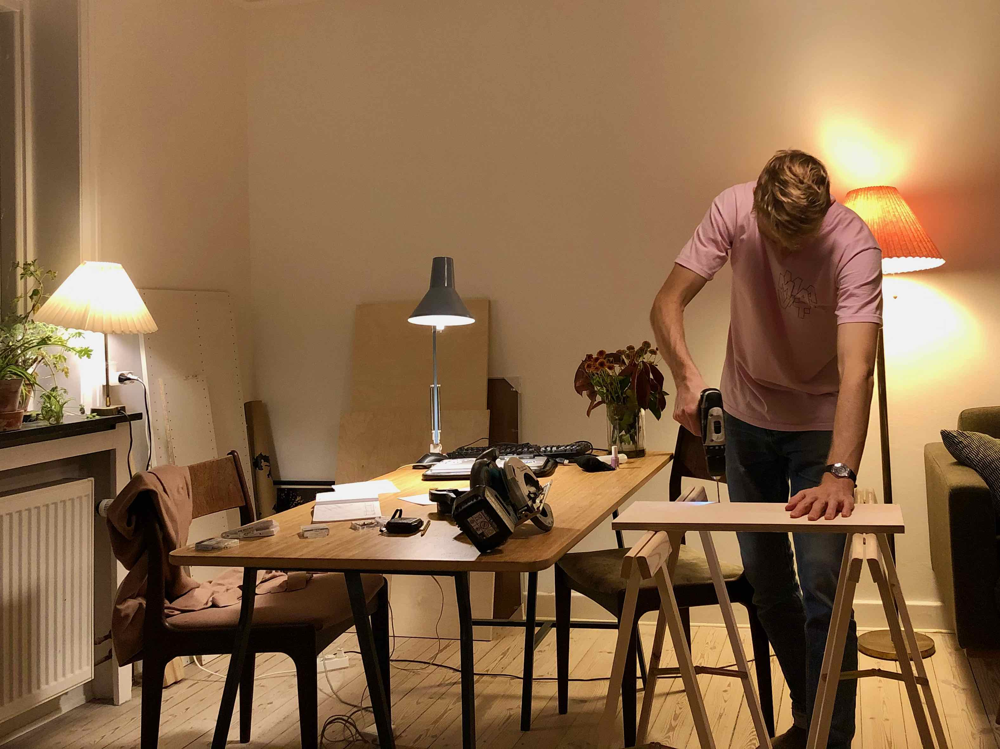

## Getting Started

### Dear Friends and Family,

So sorry for the long wait. I was terribly busy filing tons of legal forms and running back and forth between institutions instead of writing this blog. But now it’s high time to start writing again as there’s a lot to write about. How come? Because I’ve recently left Zurich for love and work. Equipped only with a bike and a surfboard (more about that later). 

 

My destination was Copenhagen, the beautiful capital of Denmark – and the hometown of my even more beautiful girlfriend, Sofie. In case you wonder how we met, have a look [here](./../vancouver/van3). Thanks to the flexibility of my studies, I could choose the location of my internship freely. And I was lucky enough to find one that would allow me to move in with Sofie. But not only the location of this internship was perfect… (more about this later).

Starting out in a new city comes with many hurdles to overcome. First, there’s all the legal requirements for life in Denmark: residence permit, CPR number (a much more powerful version of the Swiss AHV number), health insurance, nemID (password for everything).

Then, there’s the stuff that just makes life a lot easier like a local phone number and a bank account (probably the toughest one).

And lastly, there are the things without which the stress of organizing the above would become unbearable: finding friends, hobbies, and a comfy place to live in.

Assuming you haven’t come here to read about the James-Bond-feeling that comes with buying a prepaid SIM card at the Arab corner store nor how I skipped the waiting time for an appointment with the authorities like a hacker thanks to some code that checked their website every five seconds – I will only dwell on the really interesting topics. 

So, imagine it’s a Sunday morning and you have just stranded in this new city and your ToDo-list looks like this:
 
    - Get residence permit
    - Get CPR number
    - Get health insurance 
    - Get nemID
    - Get a local phone number
    - Open a Danish bank account
    - Find friends
    - Find tennisclub
    - Find surfbuddies
    - Make home hygge
    	- Fix closet
    	- Build a bed with drawers
    	- Hang posters
    	- Make shelves

Where to even start?

### Tennis

Since my brain wasn’t able to tell I had my legs decide the ‘first steps’ to take. I wasn’t very surprised they took me for a jog to the local tennis club. Over the last couple of years, tennis has become my most regular leisure activity and I wasn’t willing to change that. I snuck around the courts for a bit looking for someone to refer me to the big dog in the organization. That’s when I spotted two guys around my age playing at around my level (both – age and level – I underestimated). 

It must have been a twist of fate that had led me there at exactly this time. As it turned out, the two were taking weekly practice sessions at the club – exactly what I was looking for – and were very willing to tell me how to get there too. Fast forward one week, I already found myself playing with them. It only took a phone call, some emails, and another week until I marched into the first of my weekly practices with _Arbejdernes Tennisklub_ – ATK in short. Since then I enjoy late-night hitting sessions on Tuesdays where I can release the stress accumulated over a week. I’m amazed at just how fast it goes when you’re willing to open your mouth at the right time and location.

### Woodwork

With the largest burden crossed off the list, I could now focus on the next item: having a comfy home. Since I had come to Denmark to live with my girlfriend, this was comparatively little work. She had recently acquired a bigger apartment that was now to become our little nest. Back in summer, I had already spent some weeks renovating the walls with her. 

That meant we lived in a perfectly white but pretty empty place with a few pieces of furniture scattered around. It was high time to build some! I had put my mind to building a modular shelving system for the living room, a bed frame with drawers, and various other shelves here and there. Due to yet another twist of fate, the closest hardware store is located within walking distance. So a couple of walks and sketchy one-handed bike trips later, I had all the lumber and screws in place. The living room would become my workshop – not to the liking of my roomie. 

As a beginner at carpeting, there was no project without a bunch of fails: the lumber I had picked for the shelves turned out too thin and the bed frame is so skewed that the drawers get stuck on their narrowing rails.

Nevertheless, I am proud of my DIY-projects – after all, I had built them only with a circular saw and a screw gun.

<!-- {: width="50%"} -->

### Work and getting there

Soon enough, the first workday came around. So, I hopped on my bike and rolled downtown – together with a herd of other commuters. Yep, it’s true what you’ve heard about Copenhagen: everyone bikes here! With near-zero inclination and an extensive network of wide bike lanes, there’s no need for any other means of transport (which are also pretty good by the way). 

So, I ride to work in what looks like the annual bike demonstration back home in Zurich. And some 15 minutes later (just enough time to get fully awake in case the coffee hasn’t done its job), I park right in front of my cute little workplace. 

And boy, I really love going there for work. I’m doing an internship at a small Start-Up company that produces Motion-Capture suits. This technology allows actors and other creatives to capture their body motion in a digital format with ease. 

{: width="79%"} | 
input | output

I enjoy working there because I am given full responsibility for meaningful tasks that are intellectually stimulating, and my coworkers are simply really cool people. So, unlike every other job I did before, the lunch break is not the only thing I am looking forward to anymore.

### Surfing and Skating

With my daily life becoming a routine, it was time to spice things up on the weekends. For this, my surfboard came in handy. Before coming to Copenhagen, I had done a bit of research and found out there is a cute little surf scene in town that is dedicated to the cute little waves that wash up the shores of Denmark. So cute and little in fact, that a co-worker burst in laughter when I first told him about my plans for surfing. But to my luck, the people in that scene are fairly open to newcomers. And before long, I found myself on my first surf trip. 

We crossed the bridge to neighboring Sweden and drove some two hours to the coastal region of Ystad. There, the Baltic Sea regularly provides decent waves – larger than anything in a similar radius in Denmark. In fact, I would go on to cross the large bridge two more times before my first trip to a local break on Zealand (the island where Copenhagen lies). No wonder the other guys in the group soon reminded me that I shouldn’t get used to the large Swedish swell or it would spoil my experience in Danish waters.

(To put this in context, have a look at my modest beginnings [here](../mexico/w15).)

Speaking of water, there’s one big difference between surfing the French Côte Basque during summer and winter-surf in Scandinavia: around 10 to 15 degrees Celsius in water temperature. To deal with this difference, one requires a thick-ass wetsuit. I wrap myself in 6mm of neoprene before entering the water which makes me look like a ninja but makes me feel like a knight in heavy armor.

And there’s another big difference between the two: large waves are a rare sight in Denmark. Trapped between the rather small North and Baltic Seas, the fetch is considerably smaller than on a coast facing the vast Atlantic. Hence, surfing remains an occasional privilege here. Good thing, I brought another board for those days in between. 

