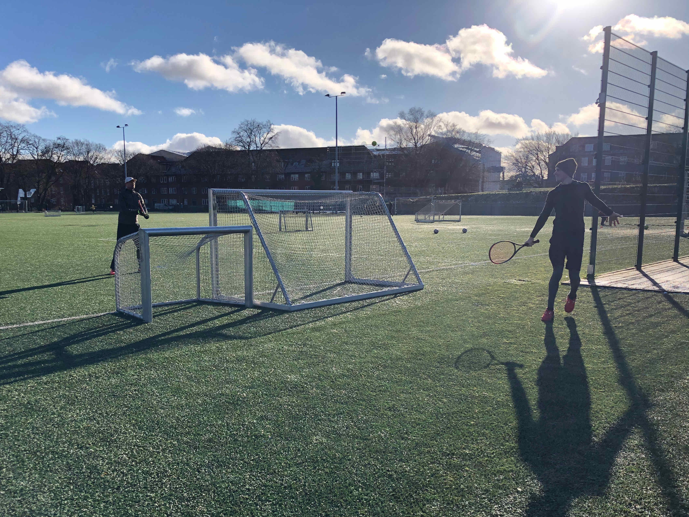

## Getting Comfy

### Dear Friends and Family,

In my last [post](cph1), I told you all about starting out in a new country (yes, I did it again). Setting up ones life is an exhausting activity. Not only did I have to chase my legal residence in Denmark. I also had to furnish an empty flat, find places and people to pursue my hobbies with, and – not to forget – start working on a new job.

*The culmination of my internship: Christmas lights made from my company's product*

As you’d expect, there wasn’t much time to just lie back and enjoy the wonderful things happening to me. But this changed drastically after the Christmas Break. Following a lot of *exploration*, it was not time for some *exploitation*. For the second leg of my internship in Copenhagen, I made sure to live every moment to the fullest. A quality that’s widely popular in Denmark.

### Hygge

You might have heard of it. The buzzword *Hygge* is every lifestyle magazine’s way of telling you that your life is too stressful while the Danes have figured it out. But what exactly does it mean? I find the literal translation as ‘coziness’ does not quite live up to the many aspects of a *hyggelig* life. Instead of a simple definition, I’d rather provide you with a bunch of examples. So, *Hygge* to me is…

… trying to replicate my favorite cookie recipe from mommy.

… playing boardgames with my future in-laws on Sundays.

… or cooking a nice meal for my friends and family.

Maybe it simply means to take the time to really enjoy something.

So, next time your favorite magazine tries to sell you the Danish lifestyle in the form of a product, don’t buy into it. *Hygge* is not for sale, but actually free to everyone everywhere.

### Danish

Now that you already got me started on Danish words, let me dwell on this wonderful language for a bit. Depending on your stylistic preferences, Danish is either the ugly sister of Swedish, or – as I see it – its sober brother. While the Swedes intone their melodic language as if they were singing (think of ABBA), the Danes keep to mumbling their atonal phrases (think of trying to argue after too many beers). My girlfriend refers to this as ‘speaking with a hot potato in your mouth’. Unsurprisingly, steaming hot potatoes have a long tradition on Danish dinner plates…

After having my mouth burned a bunch of times, I decided to sign up for language school. There, I learned about fascinating peculiarities like the *Glottal Stop* and how to pronounce Danish words when food is out of reach. To keep it brief: it’s hard. Equipped with an aggressive German tongue, words like *snegl* (say ‘snayl’, snail) and *kærlighed* (say ‘kerlihel’, love) require unfamiliar delicacy with ‘g’ and ’d’. Danish is just like a French kiss: you gotta have a skilled tongue.

To make matters worse, some of the words don’t mean what you’d think. A *time* is simply an ‘hour’, *brygge* doesn’t translate to ‘bridge’ but ‘quay’, and *ost* isn’t the eastern direction on your compass but the word for ‘cheese’.

### Life during lockdown

While I was able to enjoy some physical classes at first, Denmark pulled the plug on public life sometime in winter. This meant home-schooling, home-office, and suddenly having a lot of time at hand.

*Can't think of a better symbol for the lockdown than the frozen canal through the city*

Luckily, I didn’t have to move my beloved hobbies to the digital world. Tennis was still possible – thanks to the creativity of my buddy Enrico. With the clay courts in hibernation and the indoor facilities closed due to Corona, we sought refuge with the neighboring football club. All we needed was a calm corner on their huge field and one of their goals abused as a tennis net. Who says tennis is a material sport only for the rich?

For my other passion of surfing, this second lockdown actually came in quite handy. When you have to work ‘remotely’, why not just work from very far away (as in: next to the best waves of Denmark)? And that’s exactly what Sofie and I did. We borrowed her dad’s (super sleek) car, threw our work gear in the trunk and drove the 4.5 hours to the west coast. In *Cold Hawaii*, we spent a wonderful week of productive working, daily surfing, and occasional bubble bathing. Thanks to my Danish friend and surf forecasting guru, Anders, we were always sure to find the best peaks.

No wind, no waves. That’s the bitter reality in Denmark. And the wind blows strongest in the midst of winter. So, good surf is typically served cold. For our week in *Cold Hawaii*, this translated to air temperatures as low as -8°C. Occasionally multiplied by the chill factor of a snowstorm.

Well, luckily the water temperature can’t drop that low, right? At least, that’s what I was taught in school. Turns out my physics teacher didn’t tell me the whole truth. Adding salt to the water can lower its freezing point down to -21°C! No wonder, my feet were frozen stiff after every session…

But even if we surfed under the setting sun until darkness, it would still be as early as 4pm. Being locked down during a Danish winter means you are in for looooong evenings. Our favorite way to spend them was TV-dinner with some nice series. My recommendations to get you hooked on Nordic shows: the crime series *Bron* (the Bridge) and *Borgen* about Danish politics.

And that was more or less it. My 2021 began with a daily repetition work, tennis/surf, and series. Only when March came around did this merry loop come to a halt, as my internship was about to end. 6 wonderful months had past in what felt like a matter of weeks. No way, I could just pack my bags and go back to my old life in Switzerland. This has to continue! And I am most happy to tell you that it will. As of May 2021, I will be writing my Master’s thesis in Copenhagen. Another adventure you will surely hear more about...

PS: Denmark is still very strict when it comes to entering the country. I will let you know as soon as they lift the entry restrictions for tourism, so you can come visit me and this magical city!
