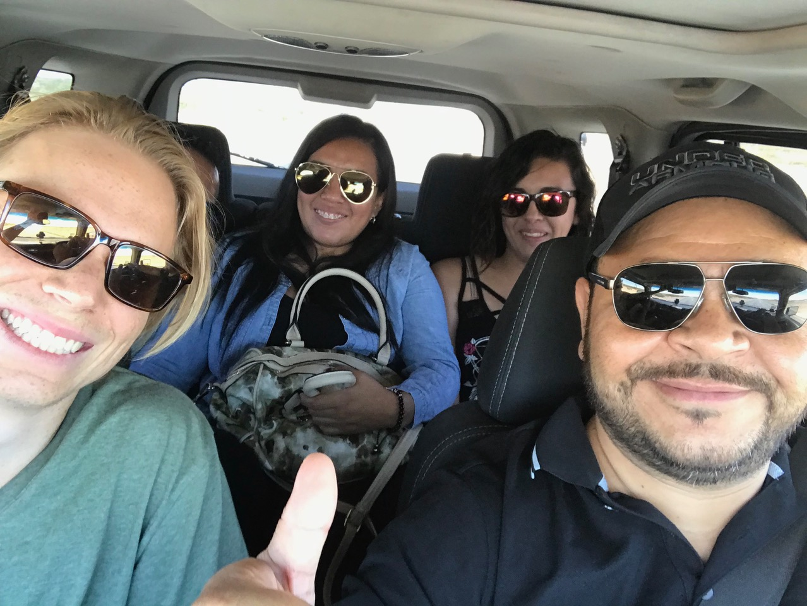

## Meine Anfänge in _Juárez_

Gestartet habe ich meine Reise in _Cancún_, diesem paradiesischen Badeort am östlichsten Zipfel von Mexiko. Wobei die Sache mit dem Paradies Geschmacksache ist: Ein Grossteil der Strände wird von den Hotels gekapert, indem sie deren Zugang erschweren. Ausserdem ist das touristische Zentrum eine Vergnügungshölle voller Strip-Klubs und Sauftempel. Nicht gerade der beschauliche Ort zum Entspannen. Wenn man jedoch auch mit einem Surfboard im welligen Atlantik oder beim frischen _Ceviche_ im Kaufhaus Freude empfinden kann, lohnt sich der Aufenthalt hier durchaus. So hab ich es zumindest gemacht und bin nach einem kurzen Zwischenstopp von zwei Tagen weitergereist in Richtung _Ciudad Juárez_, meinem zukünftigen Arbeitsort.

Angenehmer Empfang durch eine meiner Lieblingsspeisen: _Ceviche_

Wunderschöne Farben auf dem Inlandflug, kurz darauf landete ich in der Wüste

Die Reise dorthin gestaltete sich grösstenteils problemlos. Auf dem Weg zum Flughafen meinte der junge Taxifahrer noch jovial, womöglich beäugen mich die mexikanischen Männer mit Argwohn, weil sie wissen, dass ich einige mexikanische Herzen brechen werde. Das wird sich dann noch zeigen. Im Flugzeug war ich natürlich der Exot und nach der Landung etwas nervös, ob die chaotisch organisierte Abholung auch wirklich klappen würde. Doch diese Bedenken waren voreilig, denn der bestellte Fahrer fand sich schnell in der spärlich besuchten Eingangshalle. Mein rostiges Spanisch reichte leider kaum für eine sinnvolle Konversation auf dem Weg zur Firma. Dort angekommen, durfte ich noch eine Weile auf meinen zukünftigen Mitbewohner warten, _Imer Arenas_.

Mit _Imer_ und Freundinnen in der Billiard-Bar

Dieser fuhr dann auch gleich mit zwei Freundinnen vor, mit denen wir erst was essen und danach noch trinken gingen. Meine Immersion in die mexikanische Kultur und Sprache begann somit ohne Schonfrist. Am nächsten Morgen, dem Sonntag vor Arbeitsbeginn, fand ich mich auf dem Fussballplatz zwischen den Pfosten wieder. _Imers_ Leben dreht sich hauptsächlich um den Ball und treibt in beinahe jeden Wochentag auf den Rasen. Heute hatte er mich zu seinem Spiel nach _El Paso_ in den USA mitgenommen und prompt fehlten diesen die Männer für eine volle Mannschaft. Nach meinem siegreichen Einstand tranken wir noch etwas im vor der Gluthitze schützenden Schatten und machten uns alsbald auf den Weg zurück über die Grenze.

Erster Grenzübertritt noch vor dem ersten Arbeitstag

Erster Eindruck von Mexikos Esskultur: viel und fettig

Es folgte mein erster Arbeitstag, in den ich etwas nervös startete: Was, wenn mir die Arbeit nicht gefallen würde? Schnell war klar, ich würde am Computer ganze Maschinen für den Einsatz in Produktionsstrassen entwerfen – Neuland nachdem ich während des vergangenen Jahres hauptsächlich einen Roboter programmiert habe. Doch so schwierig der Einstieg sich auch gestaltete, ich durfte stets auf die Hilfe meiner überaus sympathischen Kolleginnen und Kollegen zählen. Schnell fühlte ich mich sehr wohl unter den anderen Mitarbeitern, die mich wiederum sehr herzlich aufgenommen hatten. An meinem dritten Arbeitstag durfte ich bereits schon mit zwei Kollegen nach Houston in Texas fahren, um die gigantische Anlage eines Kunden zu besuchen. Nach über 10-stündiger Fahrt durchs Niemandsland erreichten wir am Mittwochabend endlich die schwüle Hitze von Houston. Den nächsten Tag verbrachten wir in Konferenzräumen der Firma und zwischen Produktionsstrassen für Klimageräte. Alles in einer kaum fassbaren Grösse.

Rundgang durch die Produktionshallen von _Daikin_: kein Ende in Sicht

Dank der mexikanischen Diaspora in Texas kann man auch dort fein essen

Nach einer weiteren ewigen Fahrt ging es am Samstag sogleich weiter mit dichtem Program. Mein Vorgesetzter feierte seinen Geburtstag auf der Ranch des Firmenbesitzers eine Stunde ausserhalb der Stadt. Dort verbrachten wir einen gemütlichen Tag mit Essen, Trinken, Baden und Karaoke-Singen. Natürlich stellt die fremde Sprache eine grosse Hürde dar. Ob bei der Arbeit oder in der Freizeit, häufig fällt es mir schwer, mich sinnvoll auszudrücken. Doch ich habe mich unter anderem auch hierher begeben, um diese Sprache zu erlernen und meistern.

Gute Laune und laute Musik auf dem Weg zur Ranch

Karaoke, Völlerei und Wasserplausch

Abschluss einer intensiven Woche auf dem sonntäglichen Flohmarkt mit _Imer_ und Anhang
