## An der Küste von _Nayarit_

Nun geht es endlich los mit der Reiserei! Auf Nimmerwiedersehen _Juárez_ und Hallo _México_!

Meine erste Station in Richtung Süden sollte eine altbekannte sein: In _Chihuahua_ fand am Tag nach dem Ende meines Praktikums nämlich ein grosses Musikfestival mit alternativen Bands statt. Ursprünglich die Idee meiner Arbeitskollegin _Ruby_ und mir, gesellten sich dort auch noch _Ricardo_ und _Karly_ zu uns. Der Abend sollte mir nicht nur wegen der tollen Lieder in Erinnerung bleiben, sondern auch wegen des nasskalten Wetters, das ordentlich auf die Stimmung drückte. Immer noch nur mit meinen leichten Turnschuhen unterwegs, versuchte ich vor dem Konzert vergeblich noch ein Paar Gummistiefel aufzutreiben. So mussten schliesslich wiederum zwei Plastiksäcke in den Socken als Alternative herhalten.

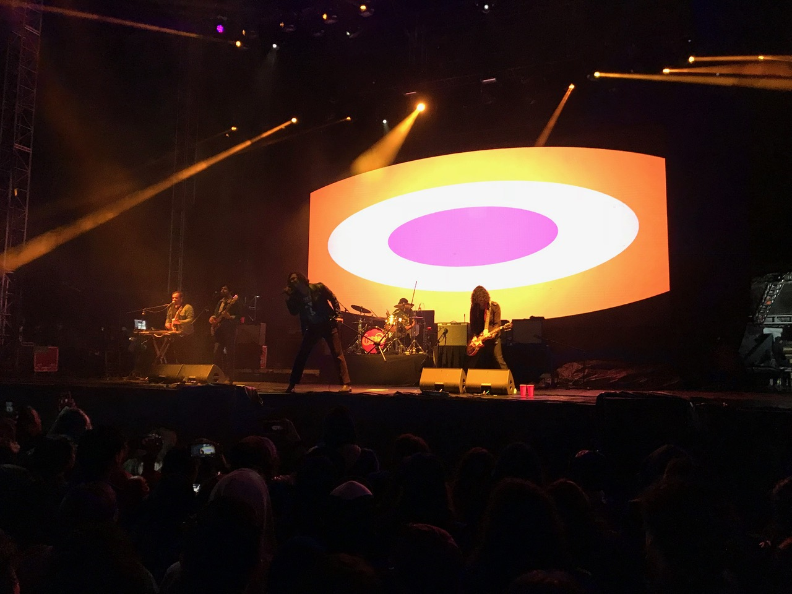
Auf der Bühne ging's heiss zu und her...

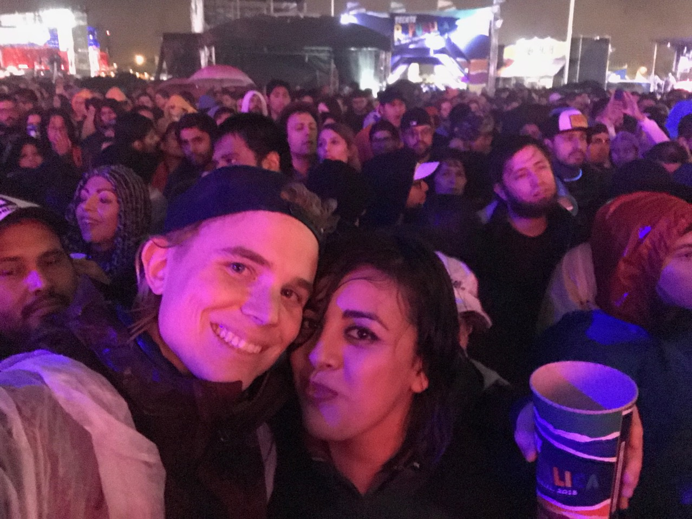
... im Publikum froren wir aber ordentlich

Die Musik gefiel sehr gut – eine willkommene Abwechslung nach der Dauerbeschallung mit traditionellen Mexikanischen Liedern während der vorherigen zwei Monate. Der Abend dauerte jedoch auch extrem lange, was meinem Rücken leider nicht gerade zugute kam. Dies ging so weit, dass ich schliesslich sogar für den lang ersehnten Lieblingssong der letzten Band aussetzen musste (zum Nachvollziehen <a href="https://youtu.be/LXFL5mdfP40">hier</a> klicken
).

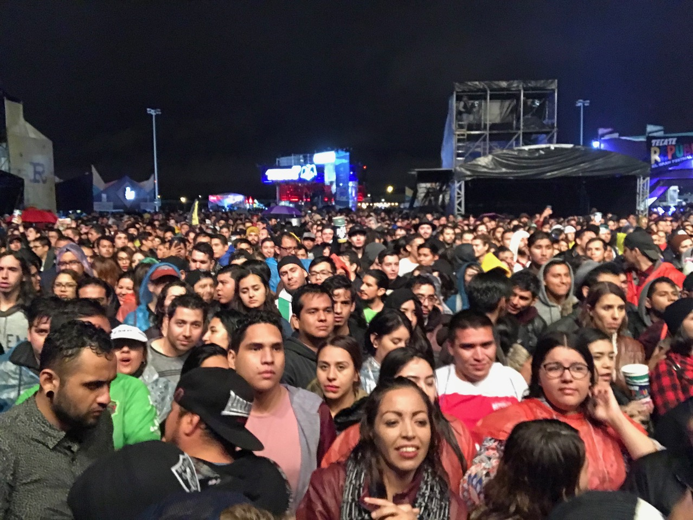
Gemeinsames Aufwärmen durch Tanz

Nach einer relativ kurzen Nacht im abgelegenen Haus von _Ricardos_ Grossmutter ging es am nächsten Morgen für _Ruby_ und mich weiter zum Flughafen von _Chihuahua_. Dass wir die folgende Woche zusammen verbringen würden hatte folgenden Grund: Auf dem Trip nach _Mazatlán_ hatte _Charlie_ (einer der Chefs bei _Alprema_) während seiner Schwärmerei vom Meer behauptet, dass _Ruby_ dieses in ihrem Leben noch nie gesehen hätte. Mehr aus Witz als Ernsthaftigkeit bot er mir daher ihre Freistellung für eine Ferienwoche an, sollte ich sie an einen Strandort mitnehmen. Und so kam es, dass wir nach einigem Hin und Her – die Mexikaner nehmen es mit ihren Versprechen nicht besonders genau – tatsächlich gemeinsam den Flieger nach _Guadalajara_ bestiegen. Von dort aus ist es nämlich nur noch einen Katzensprung bzw. fünf Autostunden bis zur wunderbaren Küste des Staates _Nayarit_, die ich umbedingt entdecken wollte.

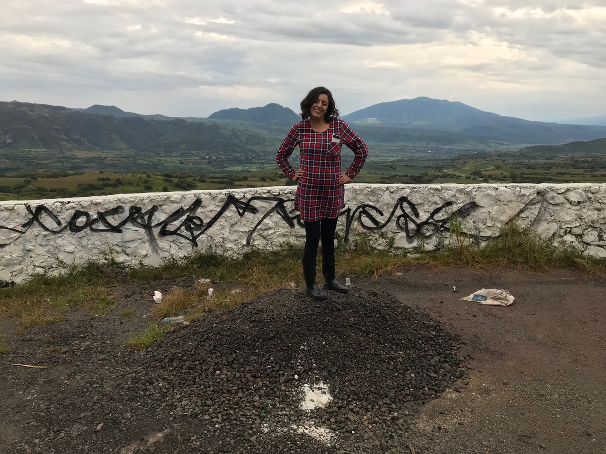
Kurzer Stopp um sich die Füsse zu vertreten

Zur Bewältigung dieses Katzensprunges mietete ich am Flughafen also einen Wagen, mit dem wir uns sogleich ins Verkehrschaos von _Guadalajara_ stürzten. Auf dessen Strassen wollte mich die Navigation dann sogleich mal über eine permanent gesperrte Autobahnauffahrt leiten. Irgendwie schafften wir die Fahrt durch Stadtverkehr, Platzregen und Dschungelwege schliesslich doch noch und erreichten bei leichtem Niesel und angenehmen Temperaturen das beschauliche Küstendörflein _Chacala_. 

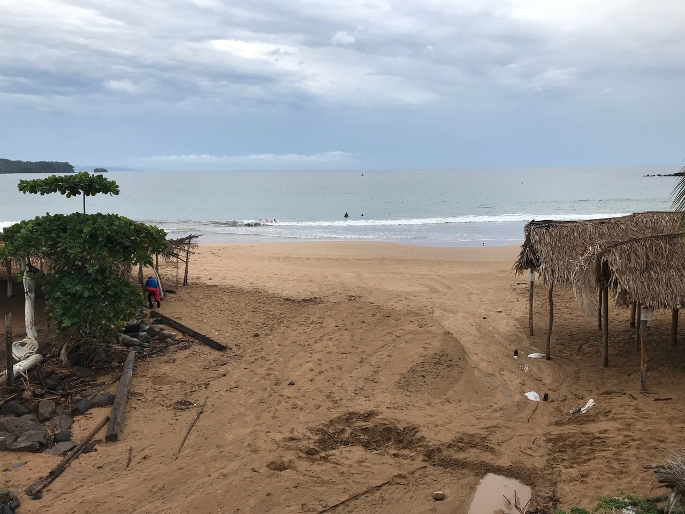
Angenehme Mischung aus Hitze und Feuchtigkeit in _Chacala_

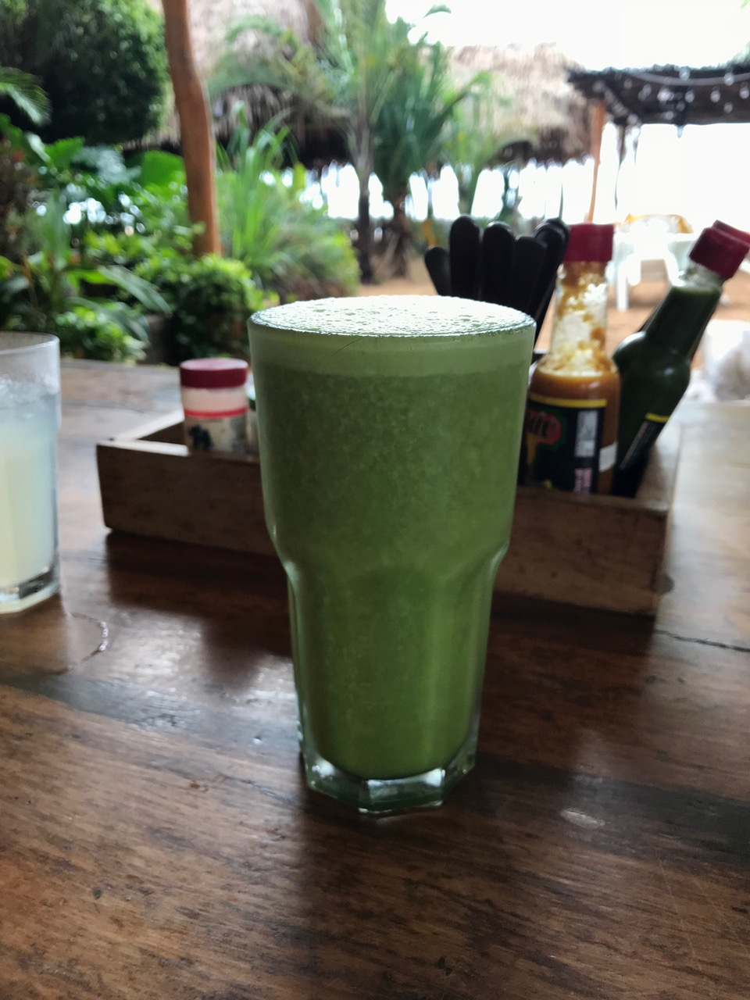
Neues Lieblingsgetränk: Jugo Verde

Der Frieden dort währte aber leider nur kurz. Während ich nämlich aus dem gefährlichen _Juárez_ hierher geflüchtet war, ist mir der noch gefährlichere Hurrikan _Willa_ vom Pazifik her entgegengekommen. Dies erfuhr ich praktischerweise dann, als sie in der Unterkunft gerade dabei waren, Kühlschränke und Backofen zu evakuieren. Etwas panisch überlegte ich, wie der vermeintlichen Katastrophe zu entkommen wäre. Meine grösste Angst war dabei nicht, den Sturm direkt am Meer zu verbringen, sondern vielmehr wegen des Strassenzustandes dort stecken zu bleiben. Den rettenden Ausweg sah ich schliesslich darin, bereits einen Tag früher als geplant ins südlichere Städtchen _Sayulita_ zu fahren. Dort wäre im schlimmsten Fall auch die Notversorgung besser.

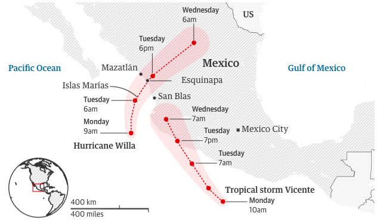
Der vorhergesagte Verlauf des Hurrikanes: _Chacala_ befindet sich südlich von _San Blas_

Es kam dann jedoch alles weit weniger schlimm als befürchtet. Der Hurrikan verfehlte meine Position (wie richtig prognostiziert worden war) und kollabierte bei der Ankunft an Land schliesslich ohne grossen Schaden angerichtet zu haben. Wir in _Sayulita_ mussten zeitweise ohne Wasser und Strom auskommen, hatten aber dennoch ein Fest: Weder die Surfer noch die Bartender liessen sich wegen eines bisschen Windes und Regens von ihrer Arbeit abhalten.

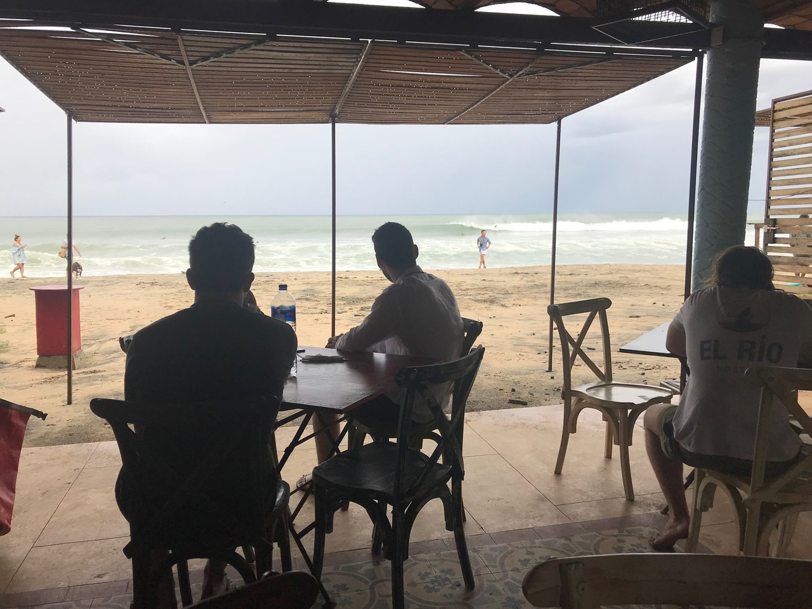
Morgen des Hurrikans: Kaffee und Omelette mit Blick auf Surfer

Nach ausgestandener Schlechtwetterlage riss die Wolkendecke am folgenden Tag endlich auf und liess _Sayulita_ wieder im gewohnten Glanz erstrahlen. Ähnlich dem Frühlingsbeginn in der Natur kam mit der Rückkehr des Sonnenlichts wieder Leben und Farbe in die Strassen des Städtchens. 

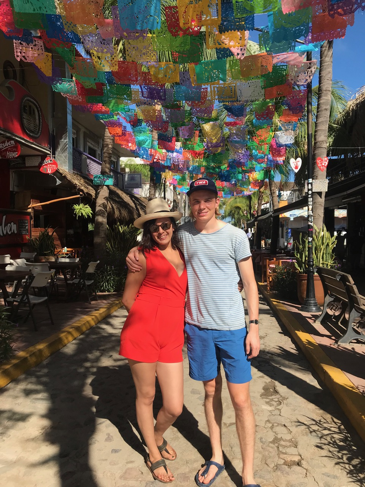
So sehen Ferien aus!

Da sich auch endlich die Grösse der Wellen wieder normalisiert hatte, wagte ich mich nun erstmals seit langem wieder auf ein Surfbrett. Eine erste Session in den frühen Morgenstunden war dabei mit Abstand die Erfolgreichste und im Nachhinein hätte ich es auch gleich dabei belassen sollen. Gegen den Nachmittag sank nämlich der Wasserstand gezeitenbedingt und legte dabei den mit spitzigen Steinen gespickten Meeresgrund frei. Trotzdem legte ich mich noch weitere drei Male aufs Brett und nutzte dabei meine Füsse jedes Mal weiter ab. Die Quittung dafür erhielt ich erst am folgenden Morgen, an dem die Füsse dermassen schmerzten, dass jede Bewegung im aufrechten Gang zur Tortur wurde. Als Bonus hatte ich mir auch noch ordentlich die Visage verbrannt, weshalb sich zu den Schmerzen zuunterst am Körper noch weitere ganz oben gesellten. Damit war definitiv nicht mehr an Surfen zu denken und wir beliessen es bei einem schmerzhaften Strandspaziergang.

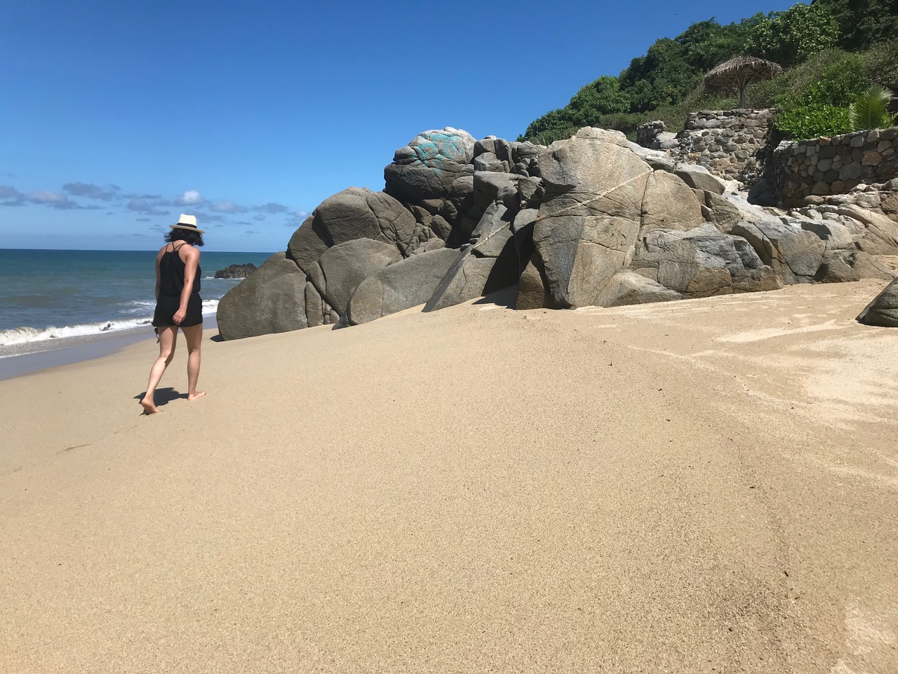
_Sayulita_ hat auch für nicht-Surfer was zu bieten

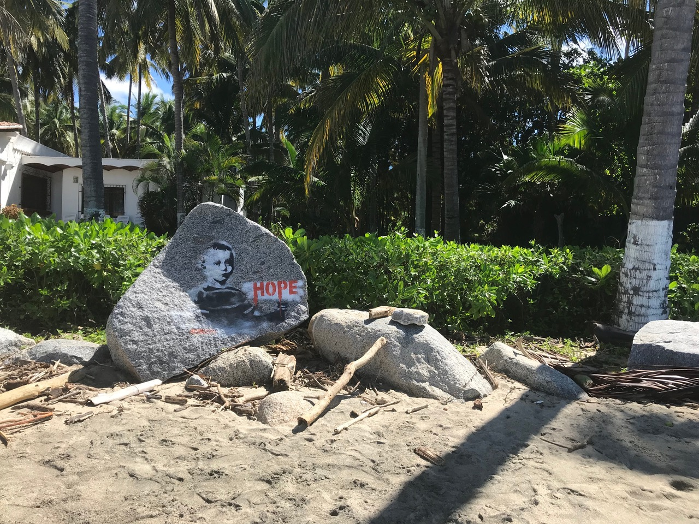
Ein Banksy an Mexikos Küste?

Nach durchzogenen Erfahrungen in _Sayulita_ (den Ort trifft dabei keine Schuld) begaben wir uns schliesslich auf die Rückfahrt nach _Guadalajara_. Als wären die Füsse nicht schon genug der Plage gewesen, spriessten nun plötzlich auch noch grosse Blassen auf meinem rechten Oberschenkel. Offenbar hatte ich im Wasser unbewusste Bekanntschaft mit einer Qualle gemacht. Nach Ankunft in der Grossstadt ging’s daher gleich mal ins Spital. Die Vorurteile und Ängste davor ein solches überhaupt zu betreten erwiesen sich jedoch als absolut unzutreffend. Besser noch: in derselben Zeit, in der ich in der _Schweiz_ erst das Formular ausgefüllt hätte, stand ich mit Rezept bereits wieder auf der Strasse. Den letzten Abend meiner Ferienwoche mit _Ruby_ liessen wir schliesslich bei einem traditionellen _Carne en su Jugo_ ausklingen.

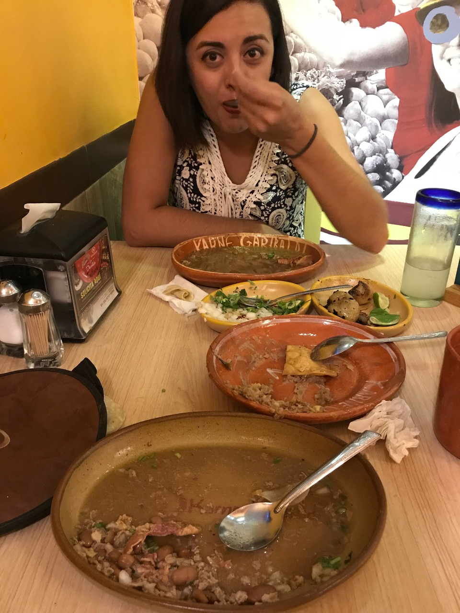
So einfach und doch so lecker: _Carne en su Jugo_

Am Samstag gingen wir die Dinge abermals locker an. Gemütliches Frühstück, durch die Strassen schlendern und die grünen Pärke geniessen. Gegen den Nachmittag begaben wir uns dann in Richtung Flughafen, wo ich mich von _Ruby_ verabschiedete, weil sie zurück nach _Juárez_ musste. 

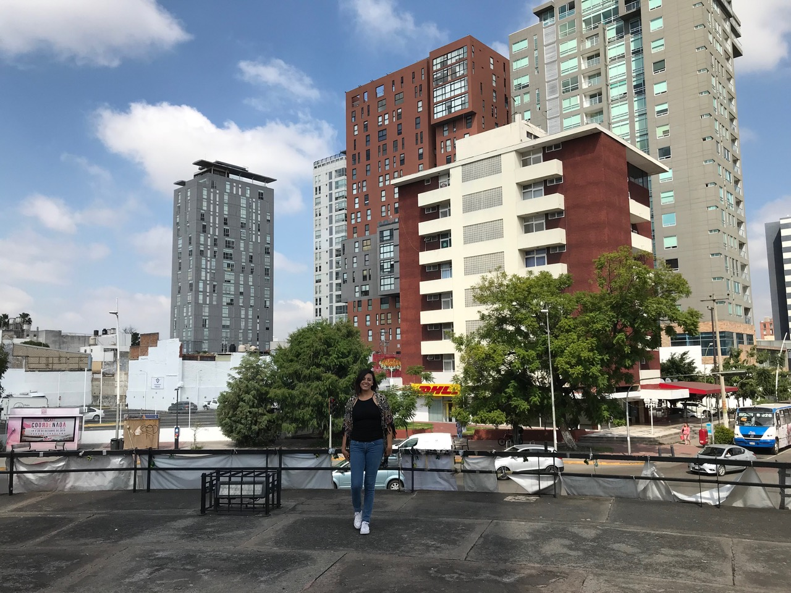
Letzte gemeinsame Momente bevor _Ruby_ auf den Flieger musste

Damit endeten die Abenteuer zu zweit und von nun an war ich auf mich alleine gestellt. Kein Problem in einer wunderbaren Stadt wie _Guadalajara_, doch mehr dazu dann nächste Woche…