## _Temazcal_ in _Guanajuato_ und Frust in _San Miguel de Allende_

Nach meiner Woche in der Grossstadt _Guadalajara_ gelüstete es mich wieder mehr nach etwas Kleinerem und Traditionellerem. Genau die richtige Mischung der beiden fand ich in _Guanajuato_, vier Busstunden östlich von _Guadalajara_ gelegen.

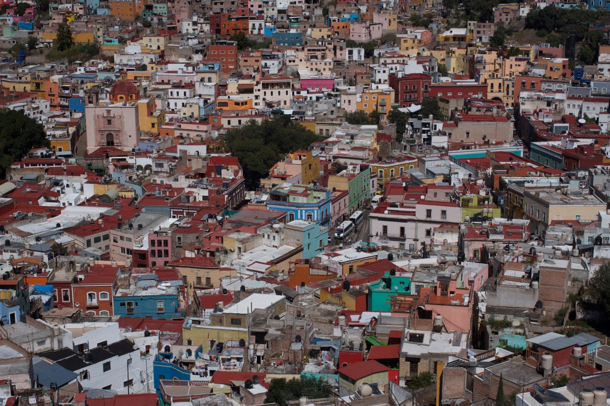
Die Farbenvielfalt von _Guanajuato_

In _Guanajuato_ nutzte ich die _CouchSurfing_ Plattform erstmals, um tatsächlich eine Couch zu surfen. Konkret hiess dies, dass ich auf dem Sofa von _Uriel_ und seinen drei Mitbewohnern unterkam. _Uriel_ hatte ich ausgewählt gehabt, weil er als einer von sehr wenigen Mexikanern die Schweiz nicht nur besucht sondern auch bewohnt hatte. Diese Kuriosität klärten wir kurz nach meiner spätabendlichen Ankunft in seiner WG auf. Vor geraumer Zeit hatte er mal Internationale Beziehungen studiert gehabt und in diesem Zusammenhang ein freiwilliges (= unbezahltes) Praktikum auf dem mexikanischen Konsulat in Bern machen dürfen. Bereitwillig erzählte er mir von seinen unvergesslichen drei Monaten, während derer er in Thun gewohnt hatte. Was sich nach dem Beginn einer steilen Karriere anhört nahm jedoch eine unerwartete Wendung: Heute verdient _Uriel_ seinen Lebensunterhalt durch das Knüpfen und Verkaufen von Kravattenschlingen für Pfadfinder.

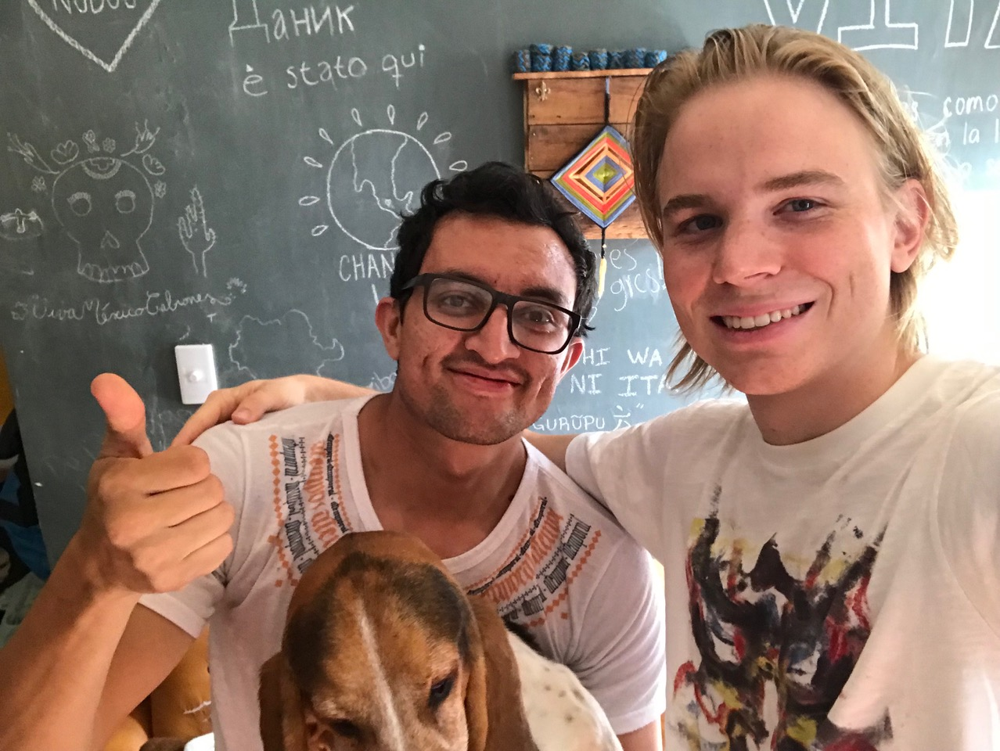
_Uriel_, sein tierischer Mitbewohner Platon und ich

Da _Uriel_ aus geschäftlichen Gründen keine Zeit fand, mich in seiner Stadt herumzuführen, machte ich mich am nächsten Morgen allein auf die Socken. Mit dem Ziel, die Farbenpracht von _Guanajuato_ einzufangen. Dazu bot es sich an, einen möglichst hohen Aussichtspunkt mit maximaler Übersicht zu finden. 

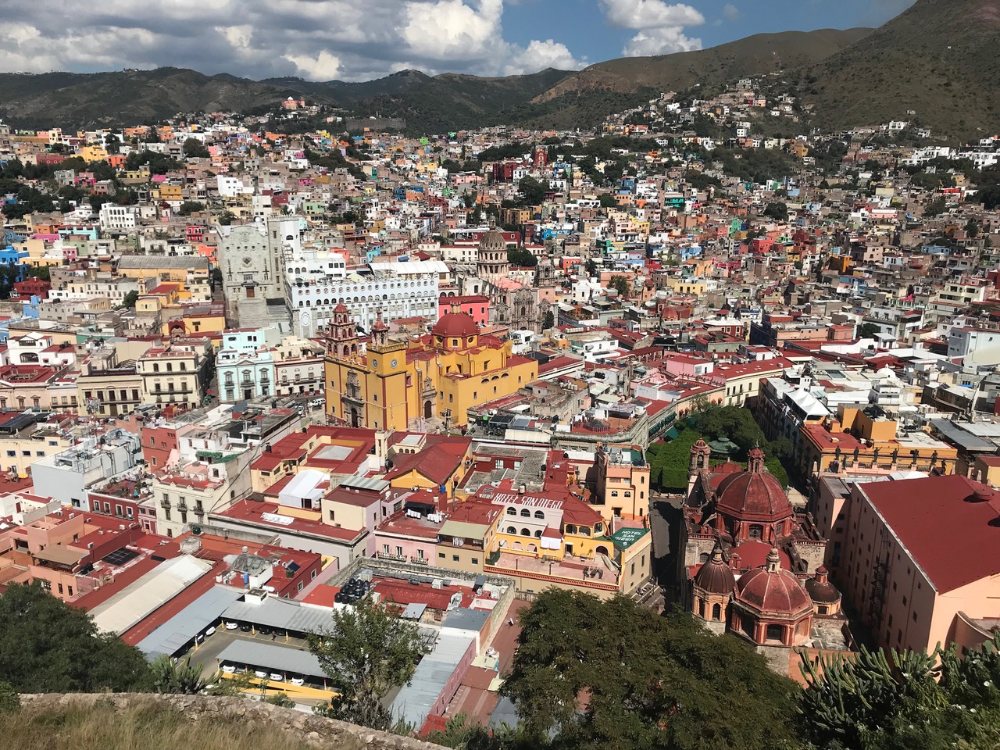
Aussicht vom Stadtberg

Doch auch von einem tiefer gelegenen Standpunkt aus sind die Farben allgegenwärtig. Die Fröhlichkeit des Städtchens _Guanajuato_ wirkte höchst ansteckend auf mich.

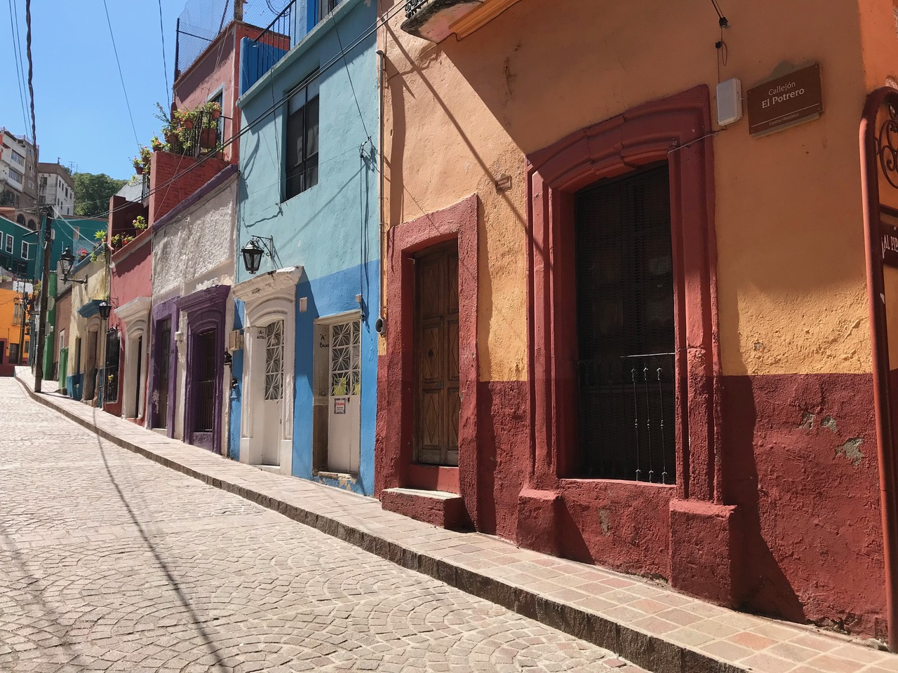
Hübsches Strässchen, wie es viele gibt in _Guanajuato_

Es folgten Besuche in der lokalen Markthalle, hippen Bücherläden und einem Dutzend Hutläden. Nach dem erfolgreichen Kauf eines Entdeckerhutes schloss ich den gelungenen Tag bei einem Treffen mit anderen Reisenden erst in den frühen Morgenstunden ab.

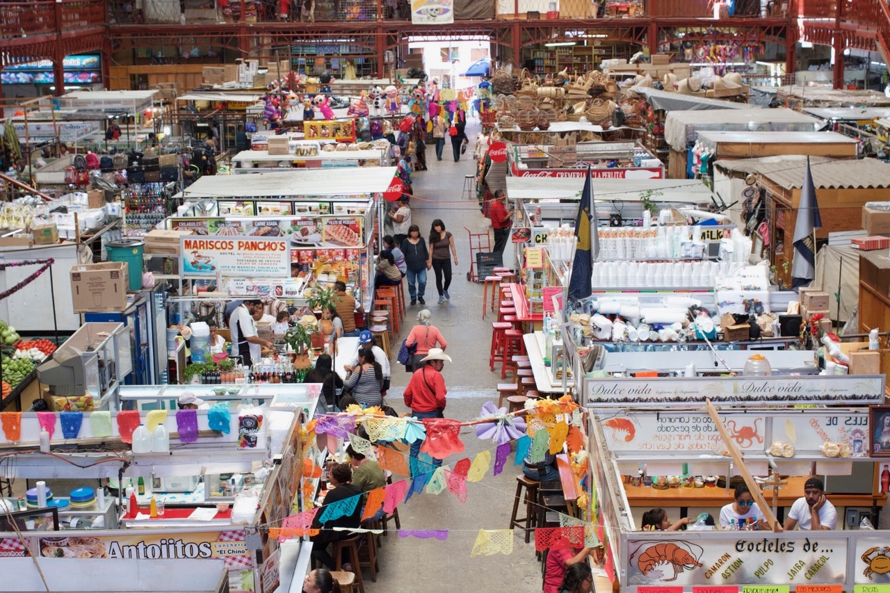
Markthalle von _Guanajuato_ – alles erhältlich inkl. Wrestling-Masken und frischem _Ceviche_

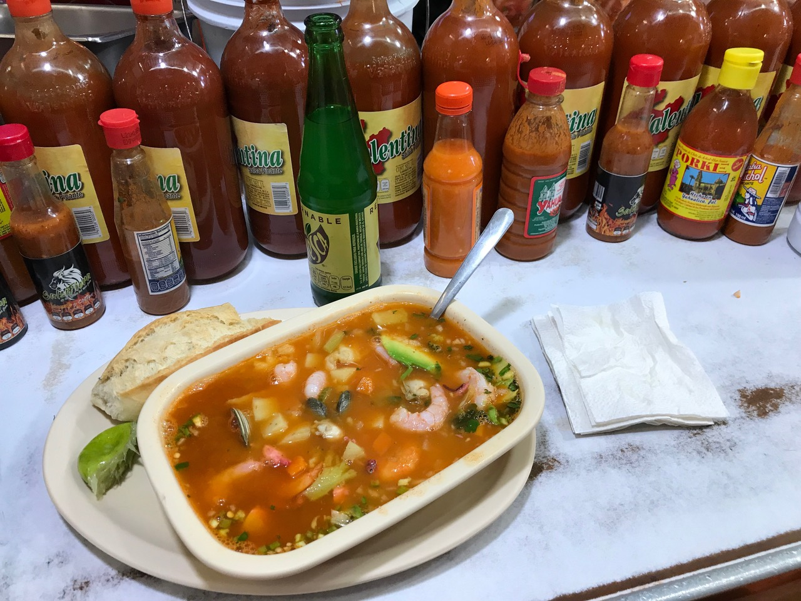
_Caldo de Mariscos_ ist immer gut, auch in der Mitte des Landes

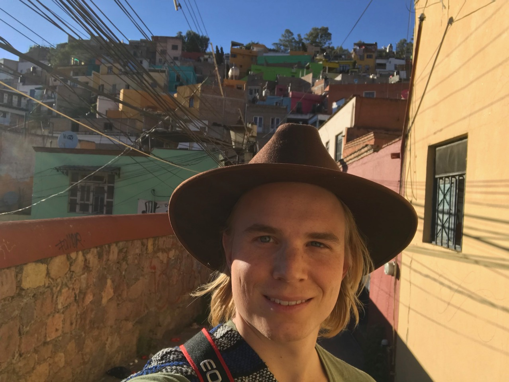
Der stolze Autor mit seinem neuen Hut

Am folgenden Tag hätte ich meine Reise eigentlich fortsetzen wollen, doch änderten sich meine Pläne mit dem Kennenlernen eines Amerikaners namens _David_ in einem veganen Café. Eher zufällig kamen wir ins Gespräch, als ich ihn nach dem Wifi-Passwort fragte. Der Texaner war mit seinem Motorrad auf einer unbeschränkten Reise durch Mittel- und Südamerika unterwegs und wohnte nun für eine Weile im hübschen _Guanajuato_ um sein Spanisch aufzubessern. Nachdem er mich von den Vorteilen eben dieser Töffs überzeugt hatte, machten wir relativ spontan für die gemeinsame Teilnahme an einer traditionellen _Temazcal_ Zeremonie am Abend ab.

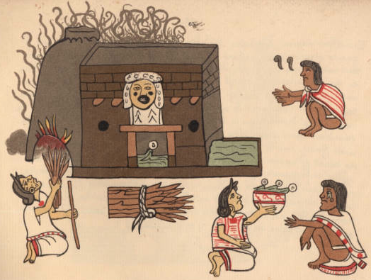
Symbolbild der _Temazcal_ Prozedur 

_Temazcal_ ist die mexikanische Version der Sauna gemischt mit rituellem Anbeten der vier Elemente – hat aber leider nichts mit dem Brauerzeugnis _Mezcal_ zu tun. Zur Begrüssung rieb uns die Zeremonieleiterin gleich mal die Visage mit einer Paste aus Avocado, Banane, Algen und anderen “heilbringenden" Lebensmitteln ein. Danach ging’s ab in die Schwitzhütte, wo wir uns im Kreis um eine Grube für die heissen Steine arrangierten. Diese heissen Steine wurden bei ihrer Ankunft (jeweils hereingebracht vom Zeremoniehelfer/Halbsklaven _Martincito_) stets mit _“bienvenidas abuelitas”_ begrüsst, was so viel bedeutet wie “willkommen liebe Grossmütter”. Nach vier Runden heissen Dampfes, ordentlichen Schwitzens, gemeinsamen Singens, bissl Nacktheit und Salbung mit Dreck/Ölen/Salz standen wir erhitzt in der Kühle der Nacht.

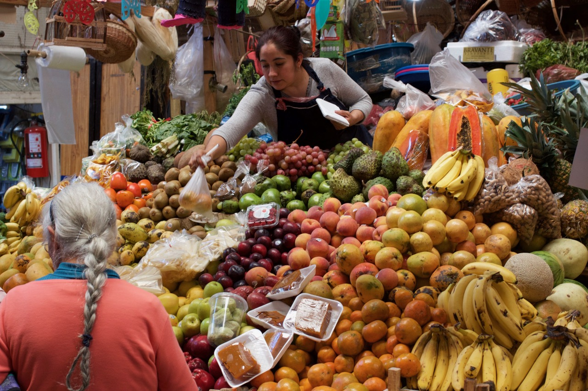
Leider fehlt mir vom _Temazcal_ jegliches Bildmaterial, daher müsst Ihr Euch an dieser Stelle mit anderen Eindrücken von der Stadt zufriedengeben

Die Teilnahme an der Zeremonie hatte den Vorteil, dass ich neben dem Gefühl einer Wiedergeburt auch den Kontakt zur reizenden _Zusel_ gefunden hatte. Die Informatikstudentin kam mit _David_ und mir noch auf einen _Mezcalito_ und lud mich fürs Wochenende in ihr Elternhaus in _Querétaro_ ein. Dies kam mir sehr gelegen, liegt diese Stadt doch genau auf meiner Route in Richtung _México City_. 

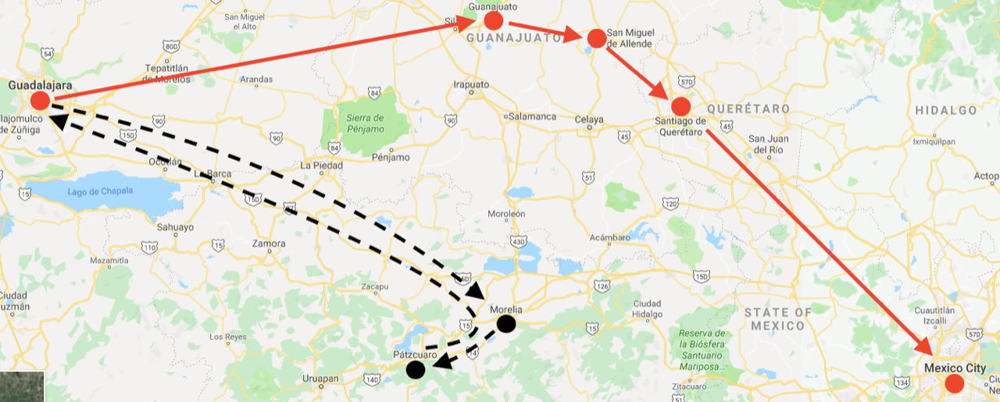
Übersicht über die aktuelle Route in <b>rot</b>, man merke: _Guadalajara_ ist nicht gleich _Guanajuato_

Doch zuerst wollte ich noch einen Zwischenstop im vielgerühmten _San Miguel de Allende_ einlegen. Bei dessen Beschreibung werde ich mich aber so kurz halten, wie mein Aufenthalt dort war: Diese amerikanische Enklave ist derart un-mexikanisch, dass ich mich über deren Empfehlung von Touristen und Mexikanern gleichermassen wundere. Dort findest Du nämlich eine _New Orleans Oyster Bar_ und die _Tacos_ kosten plötzlich das Dreifache. Nach der anfänglichen Enttäuschung hatte ich schliesslich doch noch einen guten Abend, als ich nämlich eher zufällig in eine Apérobar einiger Rich-Kids mit super Stimmung reinstolperte. Trotz meiner eher günstigen Kluft wurde ich dort gut aufgenommen. Scheint ganz so, als ob mein goldenes Haar hierzulande das Eintrittsbillet in jede Gesellschaft wäre.

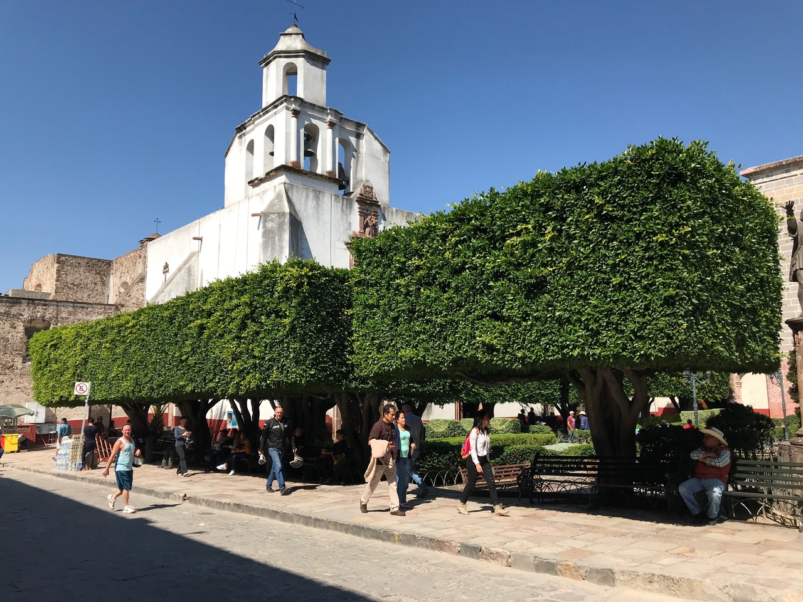
In _San Miguel de Allende_ wachsen die Bäume quadratisch; wenn das nicht bereits ein Warnsignal ist...

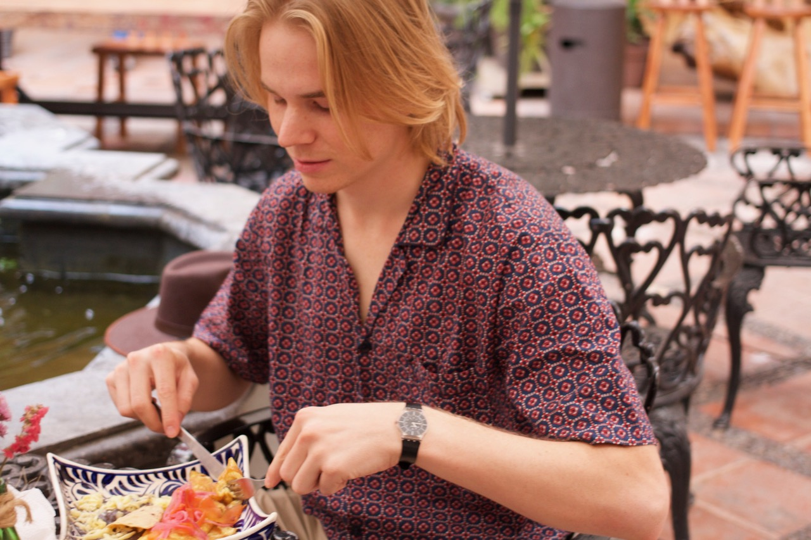
Gewiss, gut frühstücken lässt es sich an touristischen Orten meistens

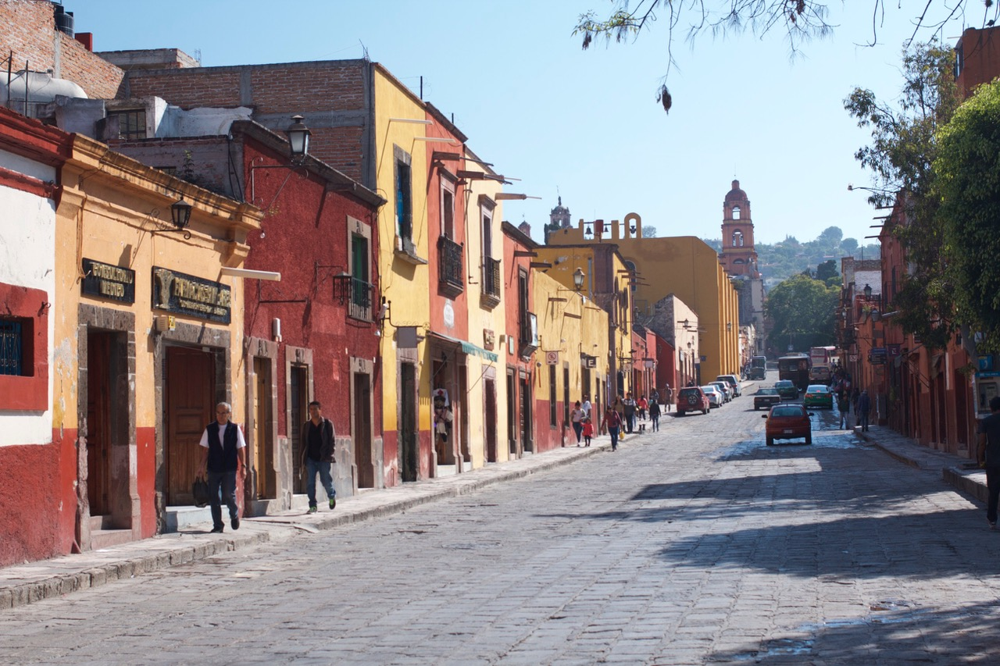
In diesen Strassen hab ich mir die Füsse wundgelaufen

Nach manchen Bieren mit bescheidenen Reisenden und weniger bescheidenen Mexikanern, vielen Runden in den hübschen Strassen und einem Ausflug ins lokale Thermalbad verliess ich _San Miguel de Allende_ ziemlich bald schon in Richtung des ungleich grösseren _Querétaro_. Dort verbrachte ich das Wochenende bei der Familie von _Zusel_ und durfte mit ihr zusammen das Stadtzentrum erkunden. Am ersten Abend fanden wir auf diese Weise einen Klub mit unglaublicher Stimmung, der sich über drei verschiedene Räume mit jeweils eigener Musik erstreckte. Wenn es sowas doch auch in Zürich gäbe!

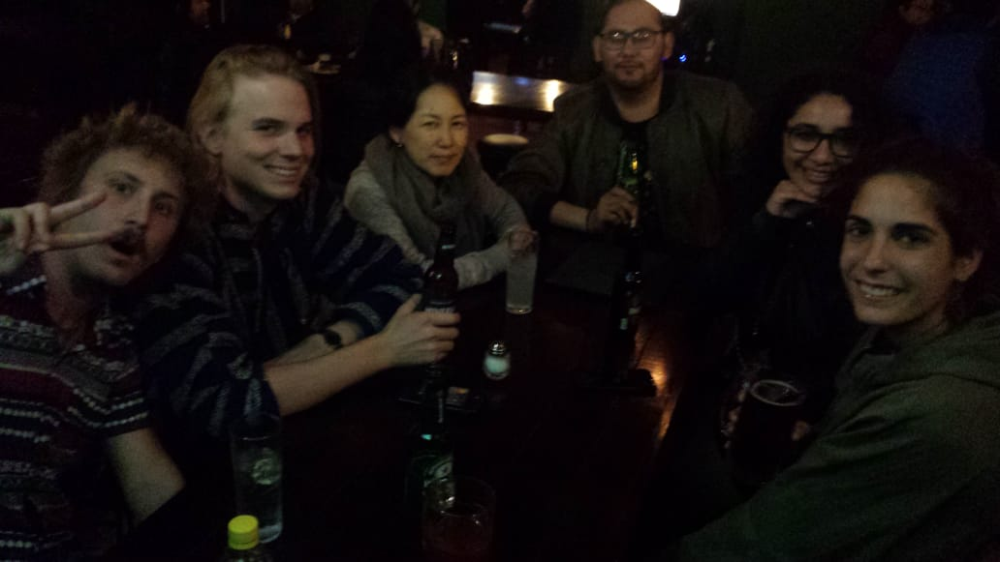
Ein paar Bier mit anderen Reisenden, so hab ich’s am liebsten