## Ein Ungeheuer namens _Mexico City_

Nach meinem Abstecher über die kleineren Orte um _Guanajuato_, _San Miguel de Allende_ und _Querétaro_ war es nun endlich an der Zeit, die wahre Herausforderung ins Auge zu fassen: _Mexico City_ (von den Einheimischen auch nur _México_ gennant). Für diesen Giganten einer Stadt habe ich mir bewusst eine ganze Woche freigehalten und dabei einiges erleben dürfen. Genau wie geplant (wahrscheinlich das letzte Mal auf dieser Reise) stieg ich also am Montag aus dem Reisebus und erstmals in eine Metro. Glücklicherweise war zu diesem Zeitpunkt mitten am Nachmittag gerade keine Rushhour, was mir eine angenehme Fahrt erlaubte. Wenn man dieses Glück jedoch nicht hat, muss man sich regelrecht in die U-Bahn hineinprügeln.

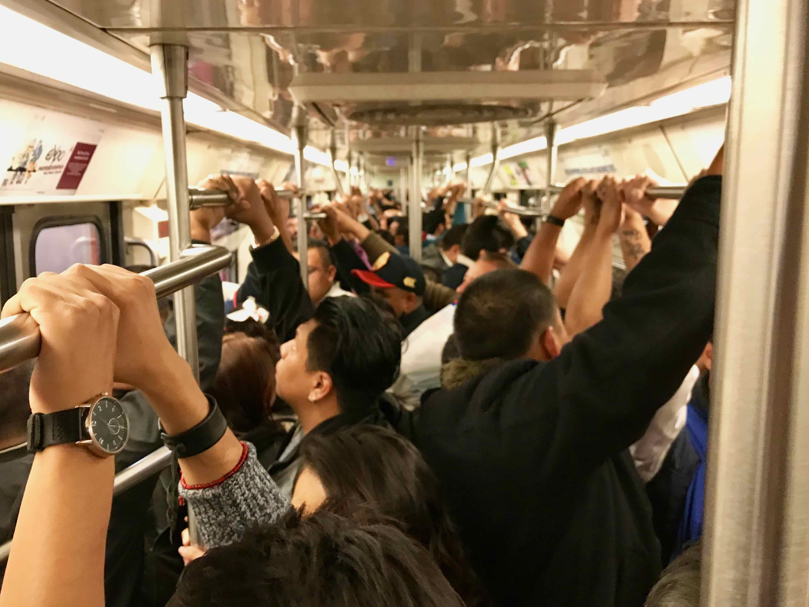
Bei maximaler Kapazität konnte ich den Arm nicht mehr fürs Fotografieren heben

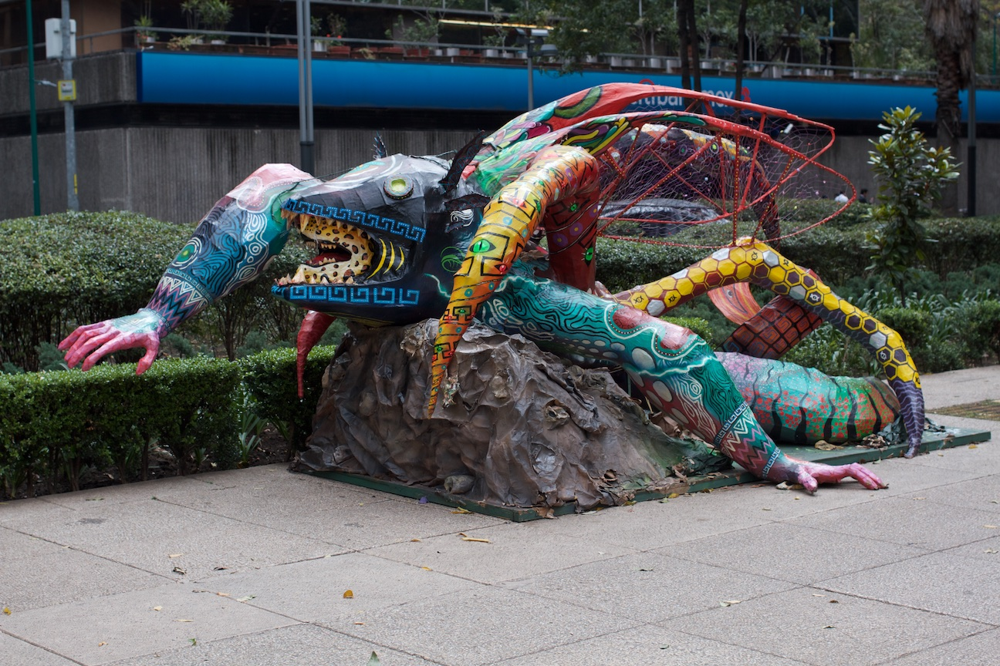
Gelungene Verbildlichung der Stadt als Biest

Plötzlich wieder Grossstadtgefühle...

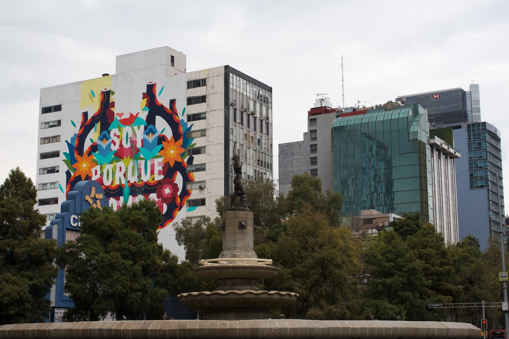
... wenn auch immer noch farbig und fröhlich

Weit ruhiger geht’s in _Méxicos_ Vielzahl an Museen zu und her. An meinem zweiten Tag verabredete ich mich mit einer Mexikanerin auf einen Stadtrundgang inklusive Besuch des riesigen _Museo Nacional de Antropología_. Dessen Ziel ist die Dokumentation der Entstehung der indigenen Kulturen um _Mayas_ und _Azteken_. Diese sind jedoch nur die Spitze des anthropologischen Eisberges, wie ich in dem nicht enden wollenden Museum erfahren durfte. Nein, da gab es auch noch _Zapoteken, Olmeken, Mixteken_ und Apotheken. Nach vier Stunden Geschichtsunterricht drohten irgendwann meine Beine unter dem Körpergewicht nachzugeben und wir übersprangen den letzten Fünftel des objektreichen Museums.

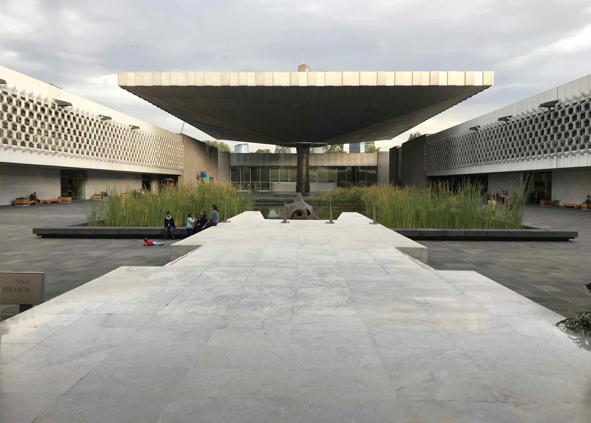
Pompöse Museumsarchitektur: Hiermit möchte sich auch der Staat repräsentieren

Prähistorisches Fundstück 1

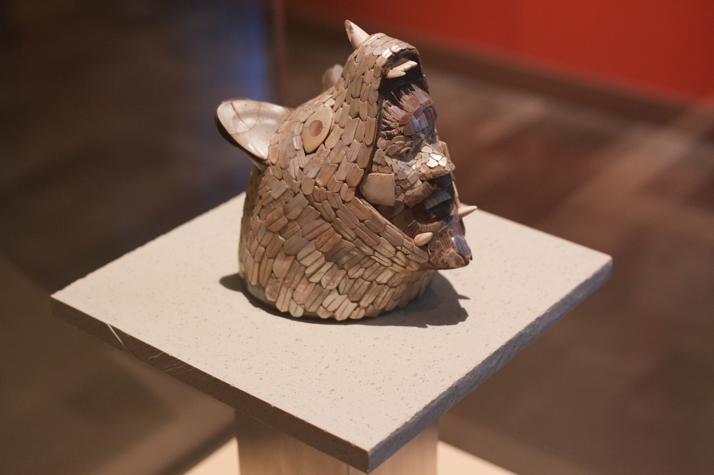
Prähistorisches Fundstück 2

Mehr aus Interesse als aus Wissensdurst besuchte ich am folgenden Tag das kleiner geratene Museo de Chocolate. Gerade als Schweizer – laut Museumsstatistik Weltmeister im Konsum der unwiderstehlichen Süssigkeit – fühlte ich mich verpflichtet, mehr über deren ferne Herkunft zu erfahren. Laut Geschichtsschreibung hatten die _Mayas_ als Erste die glorreiche Idee, die Bohnen des Kakaos zu einem zufriedenstimmenden Saft namens _Xocolatl_ zu verrühren. Von dessen Magie konnte ich mich nach dem Rundgang in der museumseigenen Cafeteria überzeugen. Als Highlight des Besuches blieb mir jedoch der kleine Raum in Erinnerung, an dessen Wänden statt Tapete hunderte Stücke Schokolade klebten. Ein himmlischer Geruch!

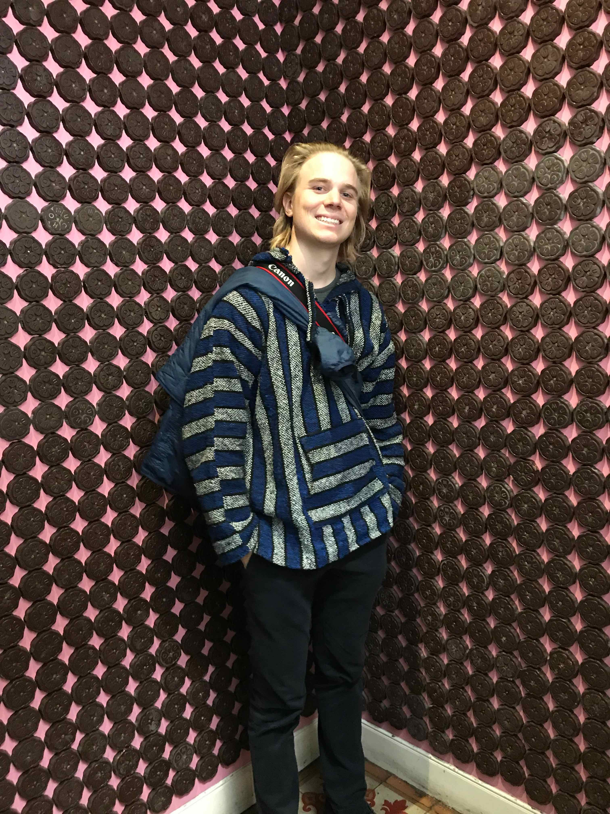
In diesem Raum kann man einfach nur strahlen

Am Mittwoch verschlechterte sich danach plötzlich die Wetterlage und brachte extreme Kälte und Regen mit sich. Der perfekte Tag für einen Besuch im Museum der grossen _Frida Kahlo_, dachte ich mir. Eingepackt in alle mir verfügbaren Kleider machte ich mich also auf zur _casa azul_, dem berühmten Haus, in dem die prominenteste Malerin Mexikos gelebt und gearbeitet hatte. Ihre populäre Visage ziert nicht nur die hiesige 500-er Note, sondern auch die typischen Touristen-T-Shirts. Entsprechend lange schliesslich auch die Schlange vor dem Museum. Mein erklärtes Ziel: den Grund für die Popularität dieser allgegenwärtigen Frau aufzuspüren. Mein ernüchterndes Resultat: absolut unerklärlich, weshalb diese Künstlerin derart gefeiert wird. Einzig ihr Verständnis für Mode schien mir aussergewöhnlich, nicht aber ihre Kunst.

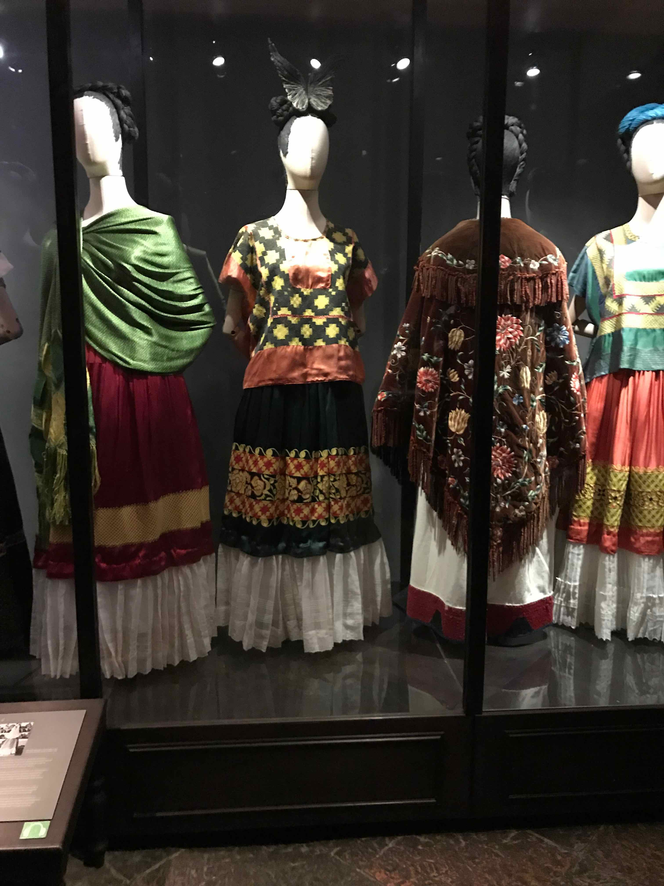
_Frida Kahlos_ beeindruckende Garderobe

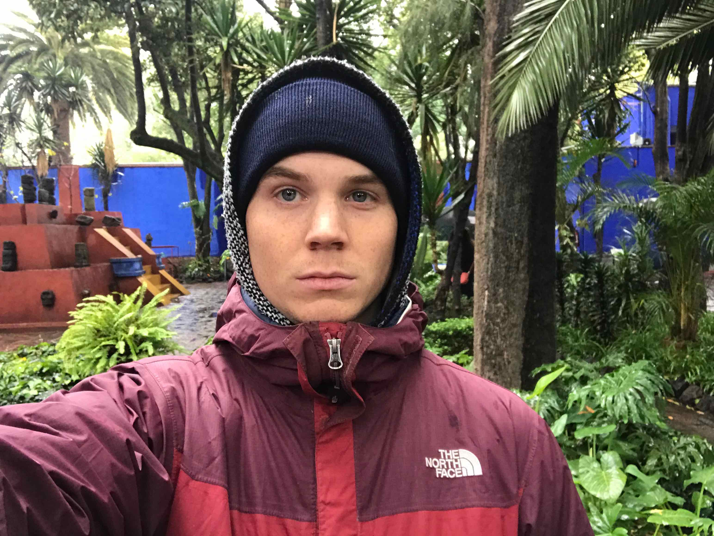
Der unbeeindruckte Autor im blauen Haus: dessen Architektur war noch das Beste

Zwar kein Museum aber definitiv eine intensive Betrachtung wert ist die öffentliche Biblioteca Vasconcelos. Die scheinbar schwebenden Stockwerke voller Bücherregale verströmen eine Aura, die geradezu zum Lesen einlädt. Irgendwie passend als organischer Kontrastpunkt zur konstruierten Umgebung hängt in deren Mitte das mächtige Skelett eines Wales.

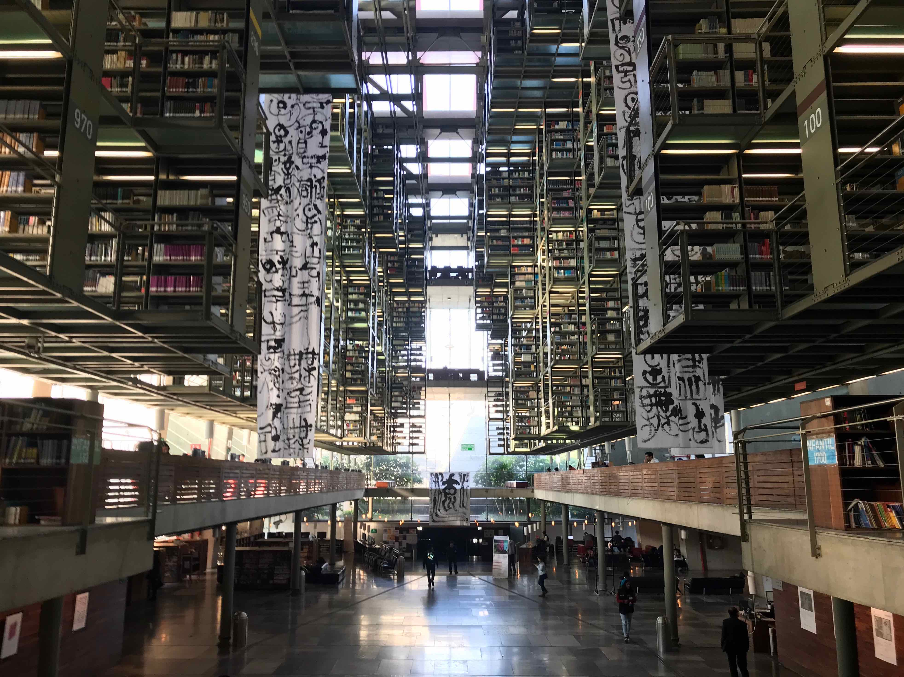
Worum handelt es sich nun hierbei genau?

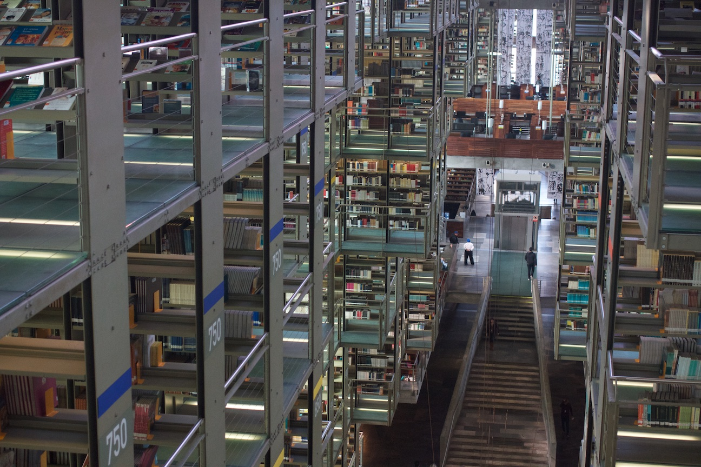
Serverraum oder Raumschiff?

Aha, da lassen sich Bücher ausleihen!

Eigentlich widerstrebt es mir, stark frequentierte Touristenorte aufzusuchen. Weil ich für die antiken Ruinen Mexikos jedoch an die hundert Empfehlungen erhalten habe, machte ich für _Teotihuacán_ eine Ausnahme. Die Fundstätte – eine Stunde ausserhalb der Stadt gelegen – wartet mit zwei der mächtigsten Pyramiden der frühen Hochkulturen auf. Natürlich war der Ort völlig überlaufen, doch hinderte mich dies nicht daran, Fotos zu knipsen und die untergehende Sonne zu geniessen.

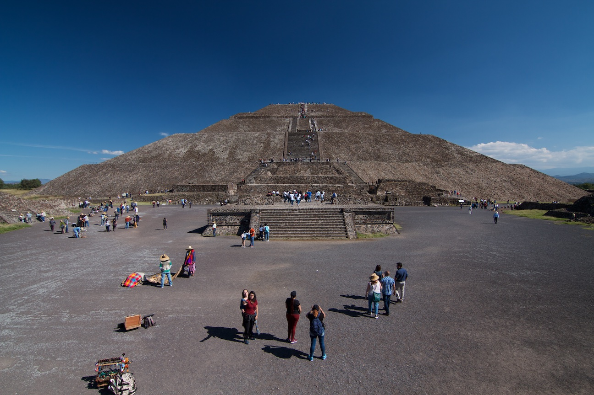
_Pirámide del Sol_, die Grösste vor Ort

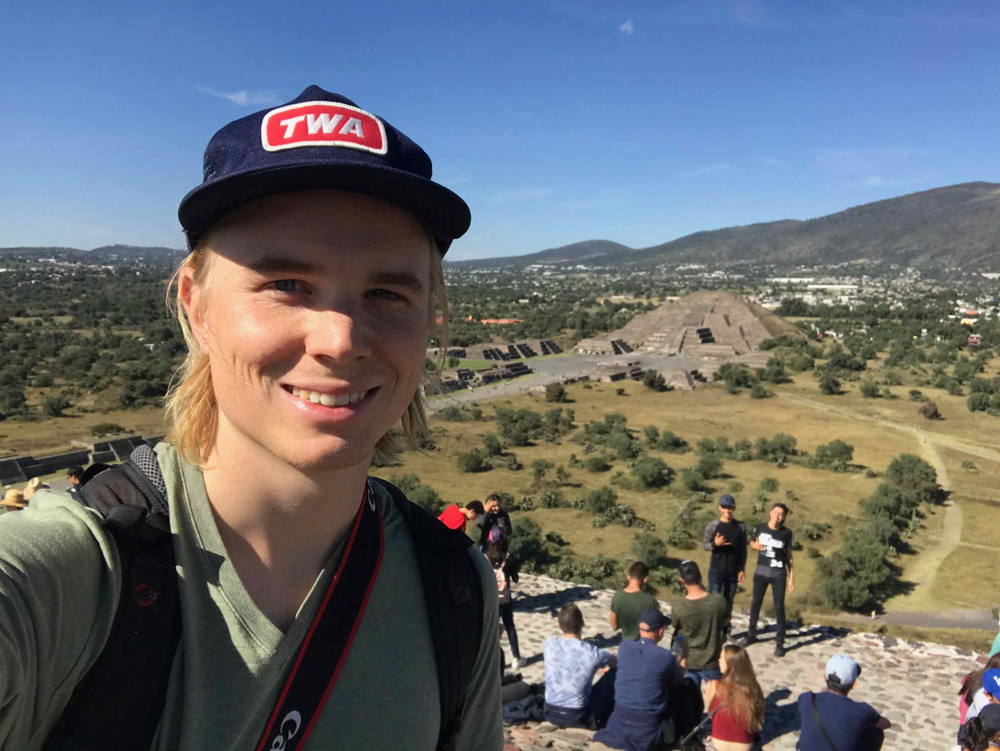
Habe mich der Masse angeschlossen und das obligatorische _Selfie_ aufgenommen

_Pirámide de la Luna_, die kleinere Schwester

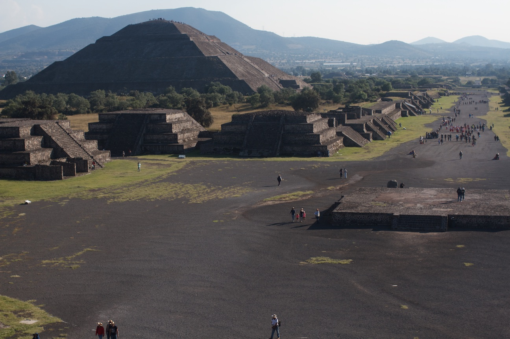
Sicht auf die gesamte Anlage von der Mond Pyramide aus

Kaum zurück in der Stadt traf ich mich wiederum mit einer Gruppe von _CouchSurfern_, um mir die mexikanische Variante von _Wrestling_ anzuschauen. _Lucha Libre_ kommt mindestens genauso unglaubwürdig daher, verfügt dafür aber noch zusätzlich über witzige Kostüme, mehr Akrobatik und den ideologischen Kampf zwischen Gut und Böse.

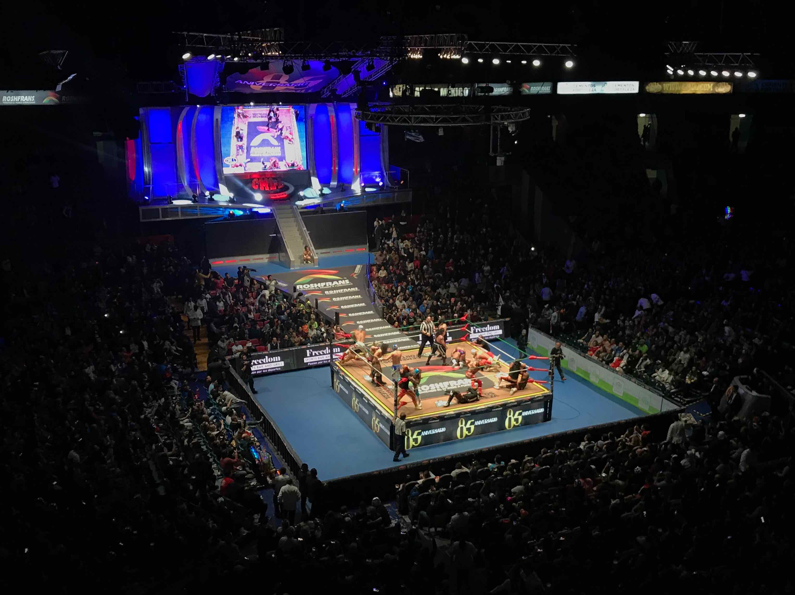
Chaos total: 16 Kämpfer, jeder gegen jeden

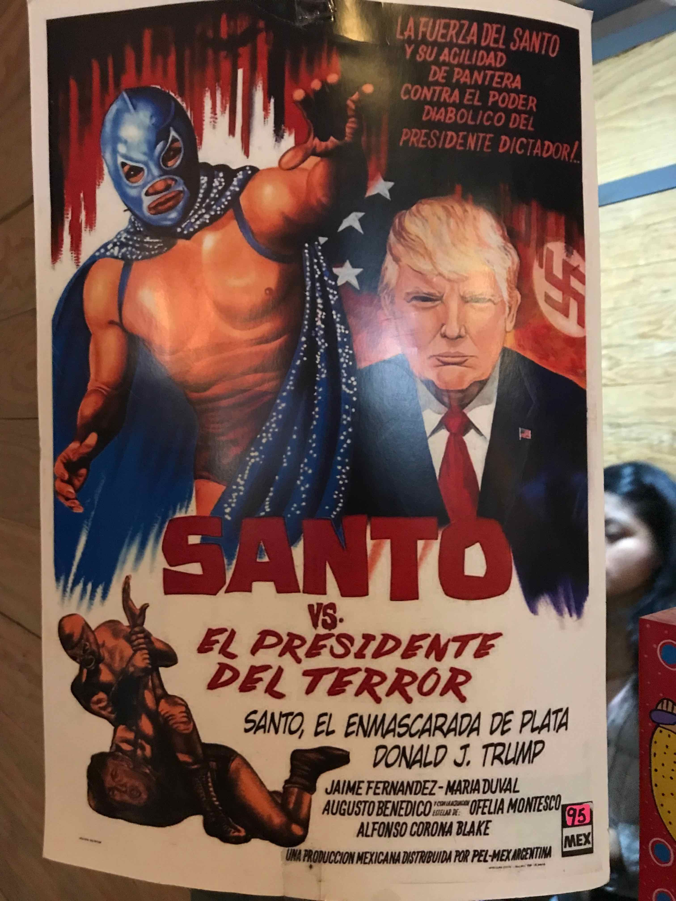
Apropos Gut gegen Böse: Wenn doch nur alle Übel dieser Welt so einfach zu beseitigen wären

Ein anderes Highlight für Touristen und Mexikaner gleichermassen findet sich auf der gegenüberliegenden Seite der Grossstadt. Das Flusssystem um _Xochimilco_ bietet die Möglichkeit, auf bunt bemalten Fähren durch die Kanäle zu schippern und zu feiern. Witzig wurde es dabei besonders, wenn andere Boote das unsere passierten und ein singender Kampf um die musikalische Hoheit entbrannte. 

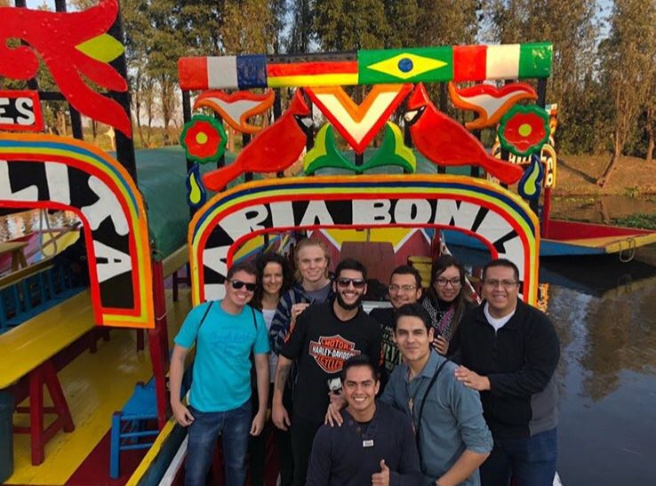
Unsere Mannschaft kurz vor dem Ablegen der _Maria Bonita_

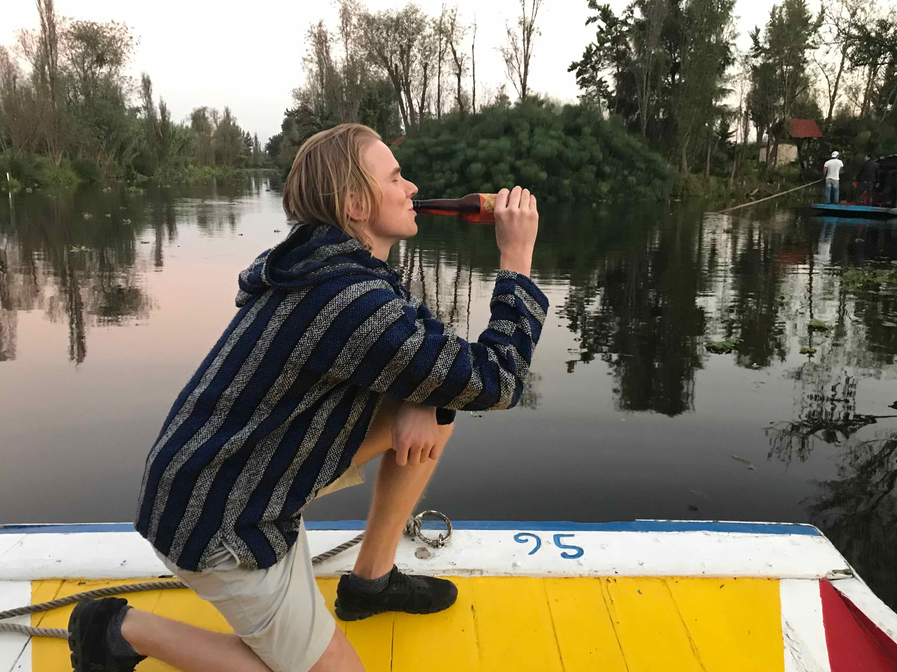
Der Autor in seiner bevorzugten Bier-Trink-Pose

Auf diese Weise näherten wir uns im Schritttempo – die Barken wurden von einem Gondoliere gestossen – der _Isla de las Muñecas_ an. Auf diesem abgelegenen “Inselchen” werden seit dem angeblichen Auffinden eines toten Mädchens Puppen in die Bäume gehängt und der Natur überlassen. Abgesehen von den paar gruseligen Momenten wird mir definitiv der Gaumenschmaus in Erinnerung bleiben, den uns die Bewohner der Insel ermöglicht haben. Ziemlich unerwartet luden diese uns nämlich beim Passieren ihrer Hütte dazu auf, den frischen Fisch direkt vom Grill zu probieren. Köstlich war das!

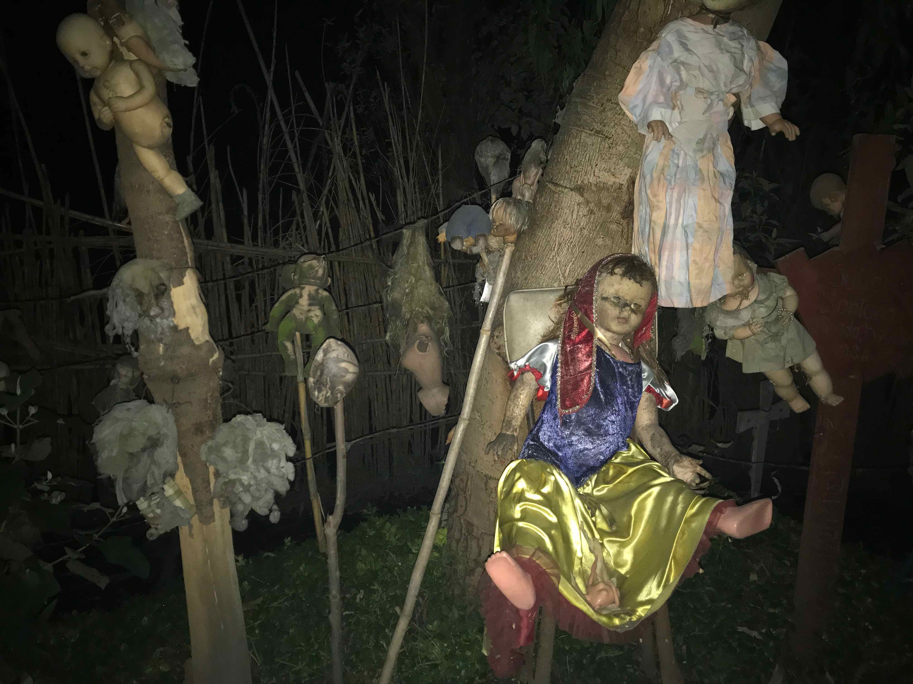
Gerade in der Nacht etwas unheimlich: die verwesenden Puppen