## Erste Routinen

Nach der stürmischen ersten Woche voller neuer Eindrücke formten sich ab der zweiten bereits erste Routinen. So befinde ich mich beispielsweise – entgegen meiner anfänglichen Befürchtung, hier kaum Sport treiben zu können – beinahe jeden Tag im Kraftraum um der Trendsportart “Crossfit” nachzugehen. Diese vereint ehemalige Stubenübungen wie Hantelheben und Liegestützen unter einem Dach und dem Grundsatz, an die körperlichen Grenzen zu gelangen. Dazu gekommen bin ich dank Freunden meines Mitbewohners, die mich ohne zu Zögern zum Gewichtstemmen und Rundenrennen mitgenommen haben. Diese regelmässige körperliche Betätigung gefährdet geradezu mein Ziel, hier in Mexiko einige Pfunde dazu zu gewinnen. 

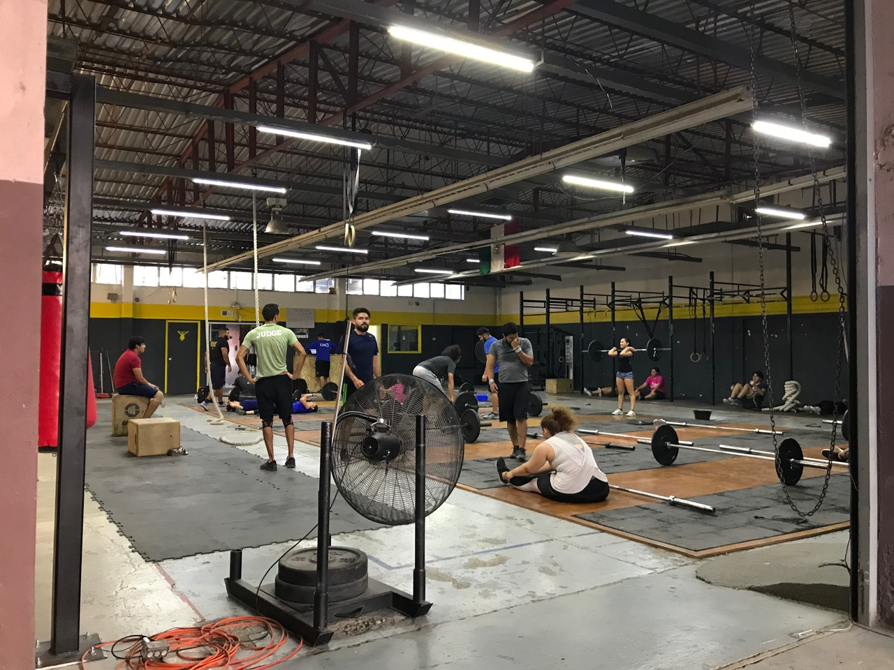
Crossfit nach mexikanischer Art

Dass dem nicht so ist, verdanke ich wiederum einer anderen Routine: Allmorgendlich um Punkt 8.40 Uhr wandert das Ingenieurteam vom Bürostuhl zur anderen Strassenseite. Dort befindet sich nämlich _Rosys_ winzige Küchentheke, hinter jener köstliche _Burritos, Quesadillas_ und weitere Variationen von _Tortilla_ (Fladenbrot) und Füllungen hergestellt werden. Dank zweier solcher Portionen lässt es sich ohne Probleme bis zum nächsten Festmahl um 13.20 Uhr ausharren. Dann nehmen mich die Mitarbeiter jeweils mit zu Essensgelegenheiten weiter ausserhalb der Firma. So bin ich bisher in den Genuss von mexikanischen Spezialitäten wie _Colita de Pavo_ (Hinterteil des Truthahns), _Caldo de Res_ (Rindfleischsuppe) und _Tacos con Tripitas, Ojos o Lengua_ (Kuttel-, Augen- oder Zungenfüllung). Wirklich interessant, wie sorgfältig die Mexikaner mit den tierischen Überresten umgehen: Eine Bewegung wie jene von “Nose to Tail” in der westlichen Welt ist hier undenkbar – die Mexikaner kämen gar nie auf die Idee, die Innereien fortzuwerfen.

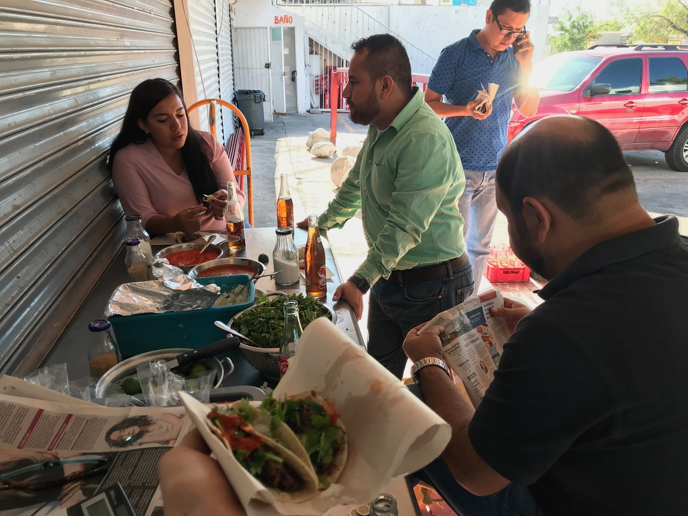
_Tacos con Barbacoa_ (alles Mögliche gemischt) zum Frühstück
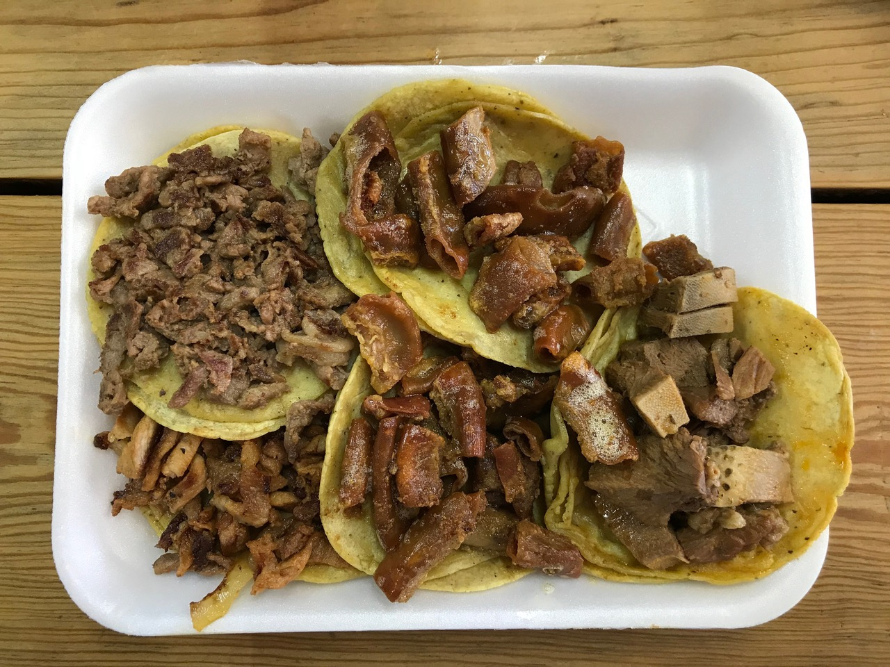
_Tacos_ mit allem Möglichem zum Zmittag: _Bistek, Tripita, Lengua, al Pastor_

Nach all dem Genuss wäre es mal Zeit, über ernsthafteres zu sprechen. Beispielsweise meine Arbeit. Wie letzte Woche bereits erwähnt, stellt die Firma Automationsmaschinen her für die Produktionsstrassen der grossen Industrienamen. Solch eine Maschine soll die Ausführung von meist nicht mehr als ein, zwei Arbeitsschritten erleichtern. Zum Beispiel soll ein Airbag für Autos präzise aufgerollt werden. Um danach an einer anderen Maschine manuell Klebebänder anzubringen. Ein Gerät, das bei letzterem helfen sollte, ist nun meine Arbeit. Dazu arbeite ich hauptsächlich am Computer und verlasse diesen gelegentlich, um bei bestehenden Maschinen auf dem unteren Stock Mass zu nehmen (oder beim Kiosk was Süssen kaufen zu gehen).

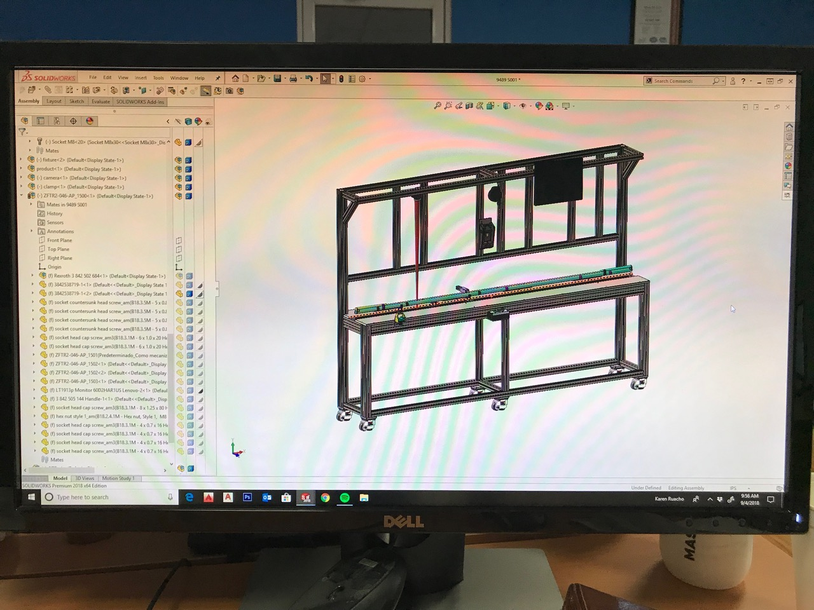
Mein typisches Blickfeld während acht Stunden täglich
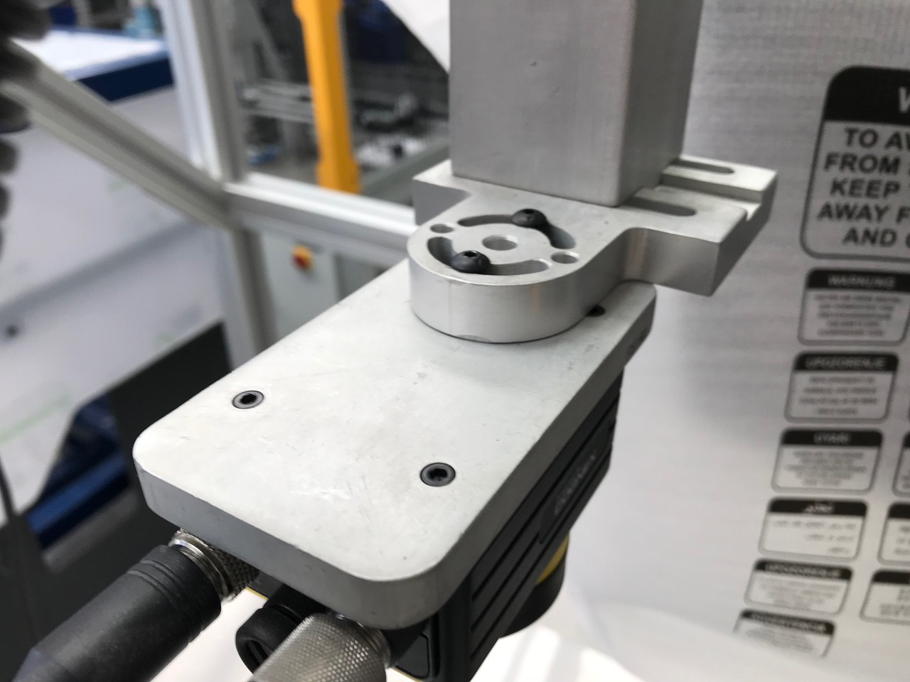
Typische Bauteile, welche die Firma herstellt, um grössere Maschinen zu bauen
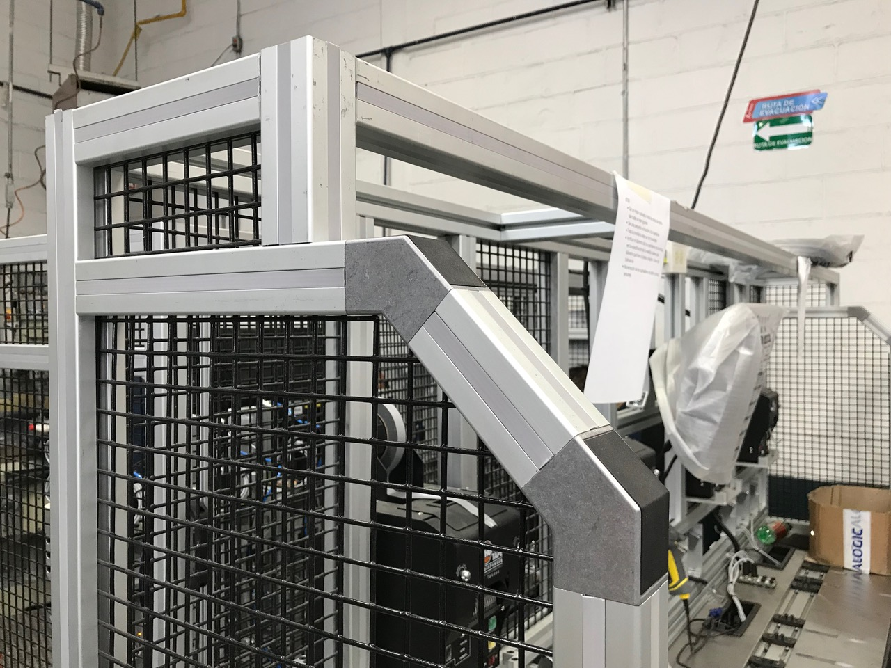
Vorbild der Maschine, die ich entwerfen sollte

Am Freitagnachmittag sagte ich relativ spontan ja zu einem Wochenendausflug mit meinem Arbeitskollegen _Ricardo_. Noch am selben Abend gesellte ich mich also zu seiner Familie ins Auto in Richtung der südlichen Nachbarstadt _Chihuahua_. Diese erreichten wir erst spät in der Nacht und legten uns bald darauf schlafen im Haus von _Ricardos_ jüngstem Onkel (von 13). Am nächsten Tag ging es sogleich weiter mit Familienbesuchen: Auf dem Weg von _Chihuahua_ nach _Cuauhtémoc_, dem Ziel unserer Fahrt, klapperten wir weitere Verwandte mütterlicher- und väterlicherseits ab. Nach manchen ermüdenden Besuchen – bei denen ich jeweils kaum verstand, worum sich die Gespräche drehten – erreichten wir am späteren Nachmittag endlich die _Cabaña_, welche mich ein wenig an _Hanses_ Domizil ausserhalb von New York erinnern.

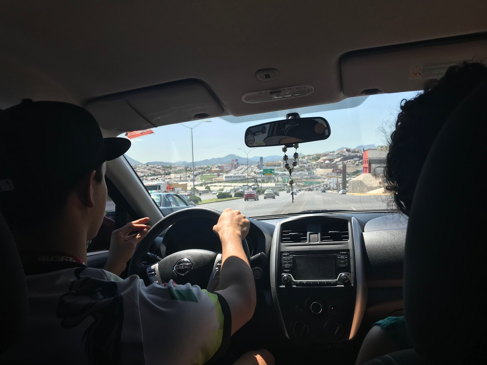
_Ricardo_, der unermüdliche Chauffeur
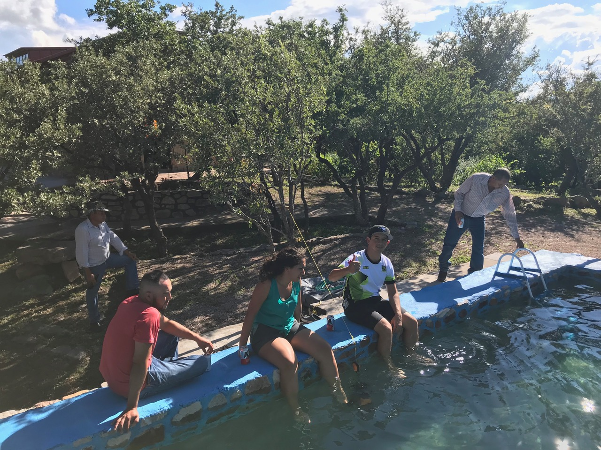
Füsse kühlen nach der Ankunft; leider war es zu kalt für ein Ganzkörperbad

Und damit zum Ziel des Ausflugs: Um die Familie zusammenzuführen, wollten einige der vielen Onkel am Sonntag an einem Fahrradrennen teilnehmen – inklusive mir und _Ricardo_. Die vielen Besuche dienten unter anderem dazu, ein Fahrrad und Ausrüstung für mich aufzutreiben. Was für ein Glücksfall, dass ich hier meiner geliebten Sportart nachgehen können würde!
Und so fanden wir uns am Sonntagmorgen früh also am Start des Rennens wieder. Diese Möglichkeit, ordentlich Dampf abzulassen, kam für mich gerade zum richtigen Zeitpunkt. Der Verlust von Grossmami und einige Probleme vor Ort hatten mir zuvor ziemlich zugesetzt. Jedenfalls gab ich ordentlich Gas und konnte die 60 Kilometer durch abwechslungsreiches Gelände (alles von der Strasse bis zur Flussdurchquerung) in knapp drei Stunden abspulen.

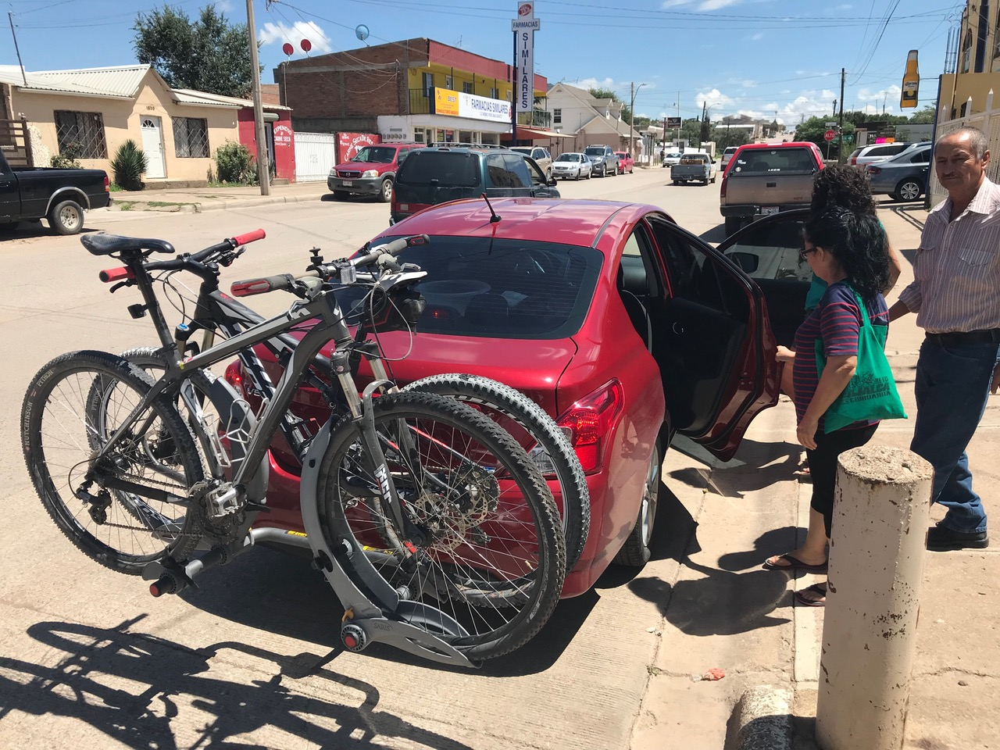
Aerodynamisch sieht wahrscheinlich anders aus
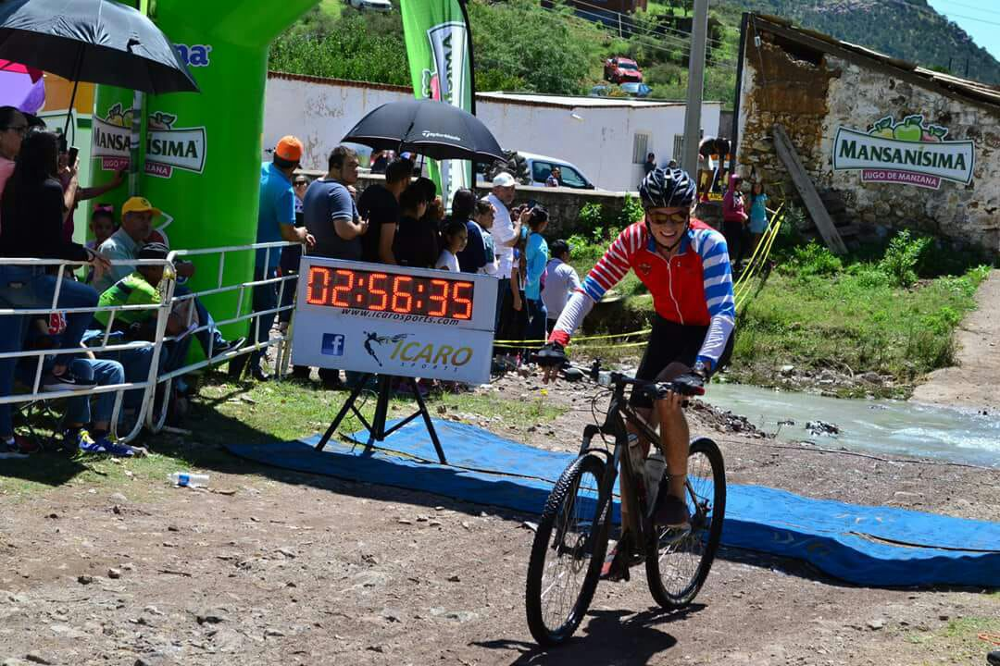
Zieleinfahrt nach erschöpfenden 60 Kilometern
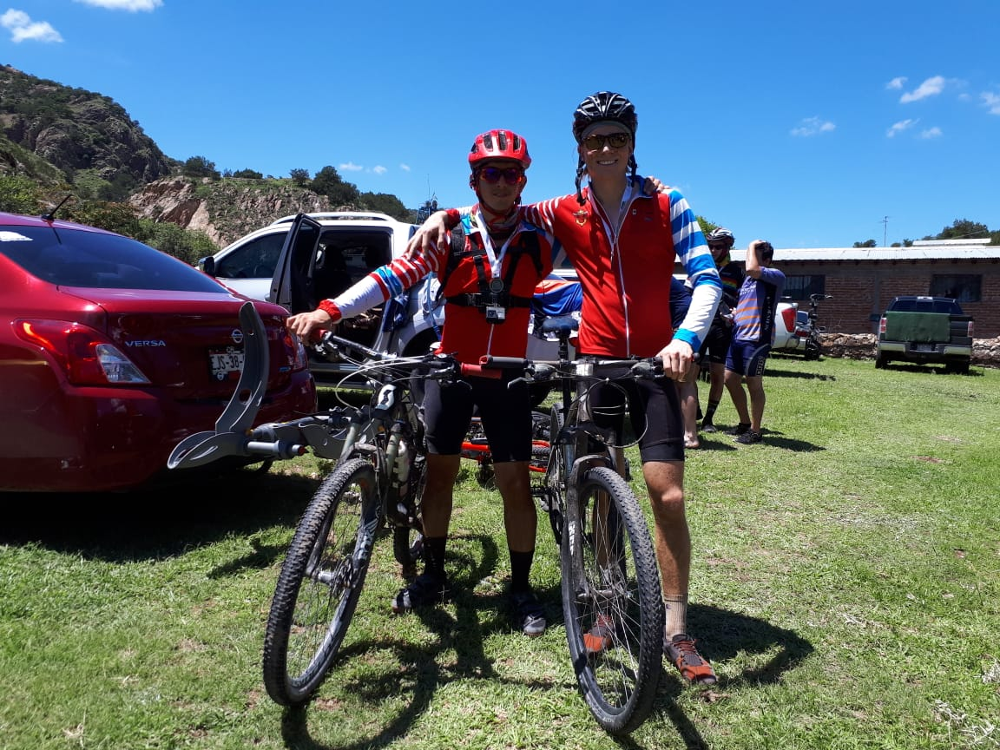
_Ricardo_ und ich stolz nach dem Rennen

Nach dem Rennen kamen alle beteiligten Onkel mit jeweiliger Familie in unserer _Cabaña_ zusammen für ein traditionelles _Carne Asada_. Dessen Zubereitung ist denkbar einfach: Auf den Holzkohlegrill lege man dünne Scheiben Rindfleisch, die danach in _Tortillas_ mit feinen Saucen und Zutaten genossen werden. Wiederum wurde ich sehr herzlich aufgenommen und hatte einen super Nachmittag. Den Abschluss dieses fantastischen Wochenendes bildete die sechsstündige Rückfahrt im beklemmend engen Auto von _Ricardo_. Trotz resultierender Beinschmerzen würde ich noch die ganze nächste Woche von diesem Energieschub profitieren können.

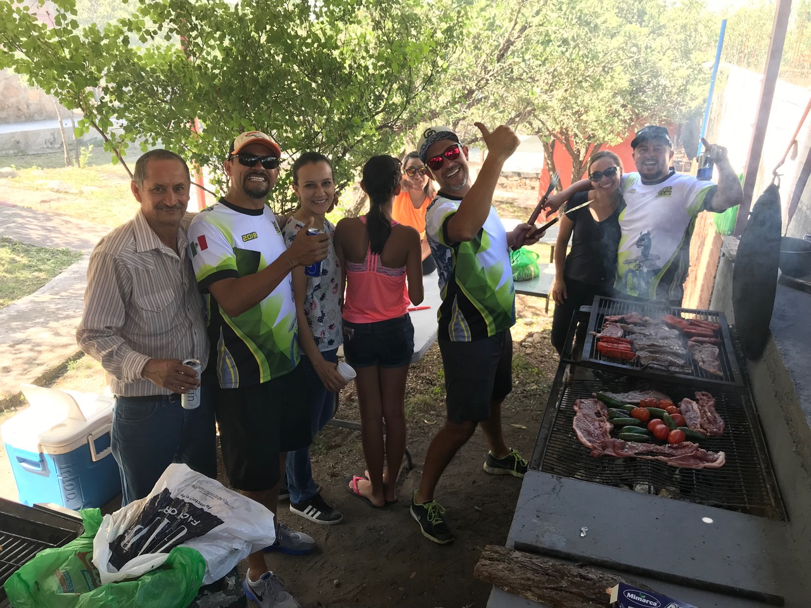
_Carne Asada_ erfordert trotz einfachem Rezept eine erfahrene Hand in der Zubereitung
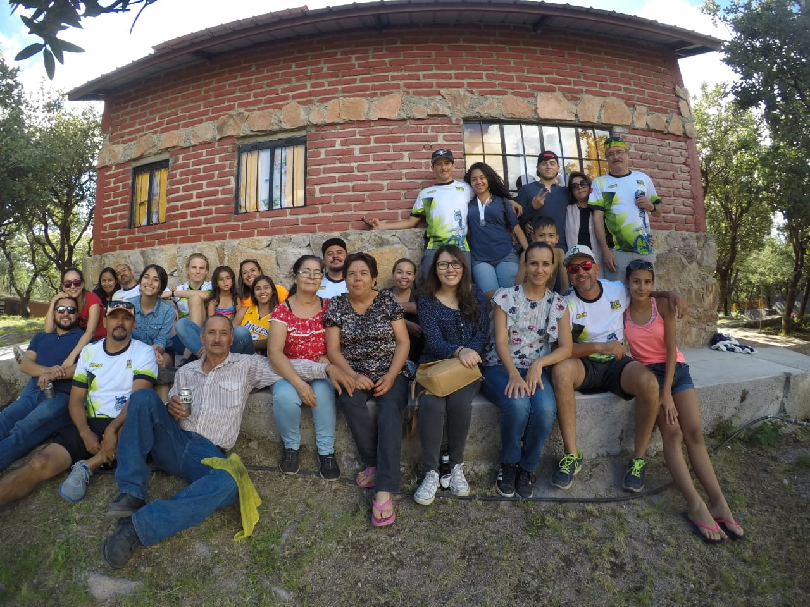
Finde den Schweizer!
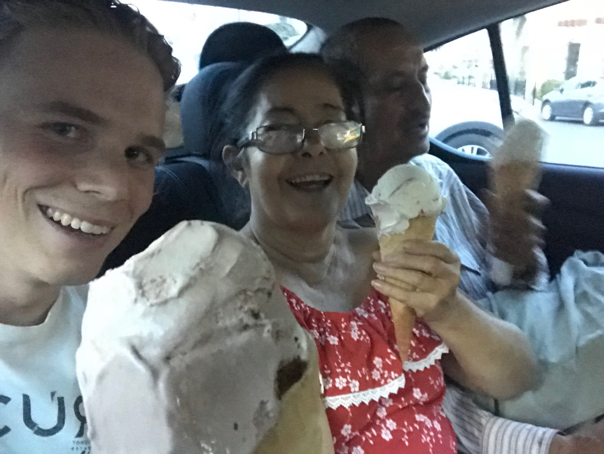
Kleiner Genuss zwischendurch auf der engen Rückbank