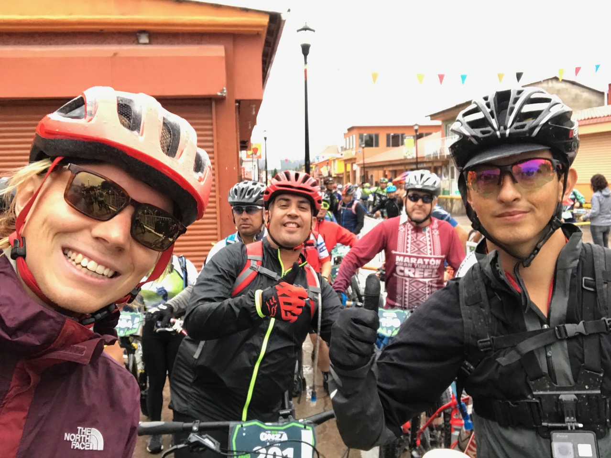
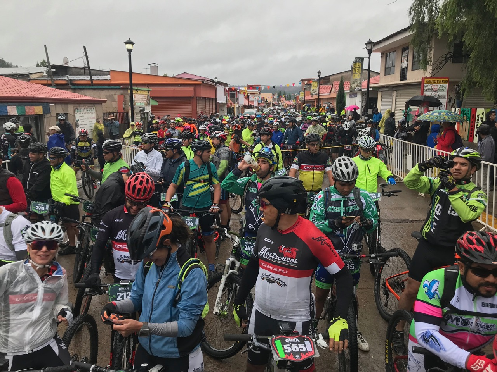
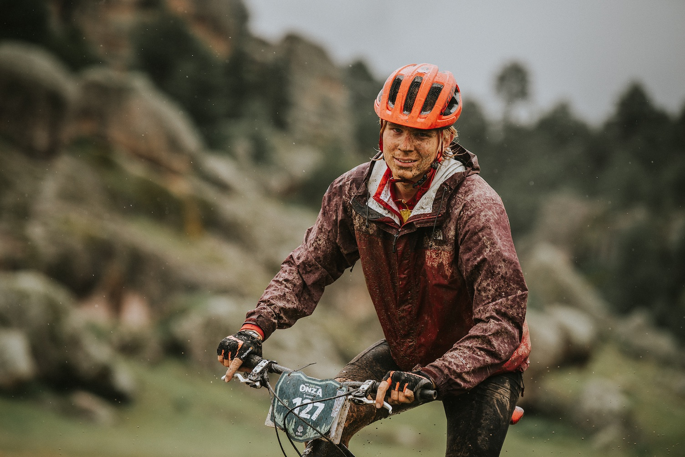
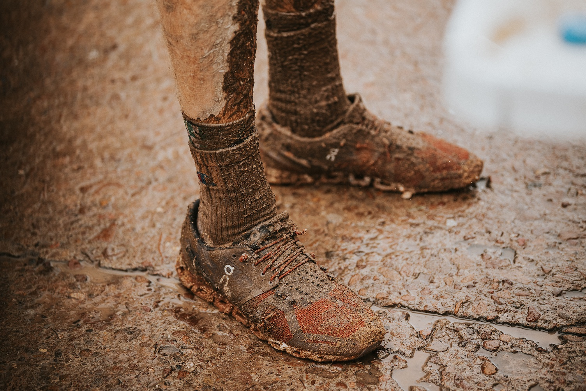
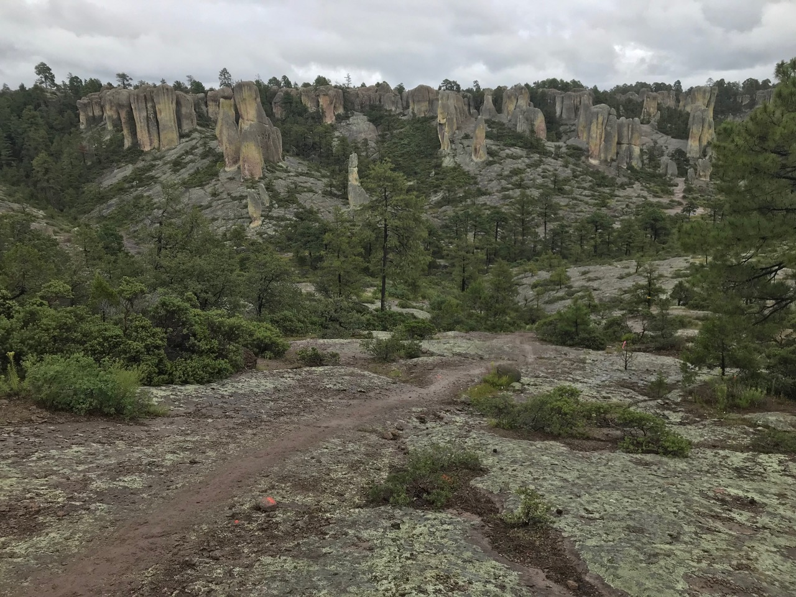
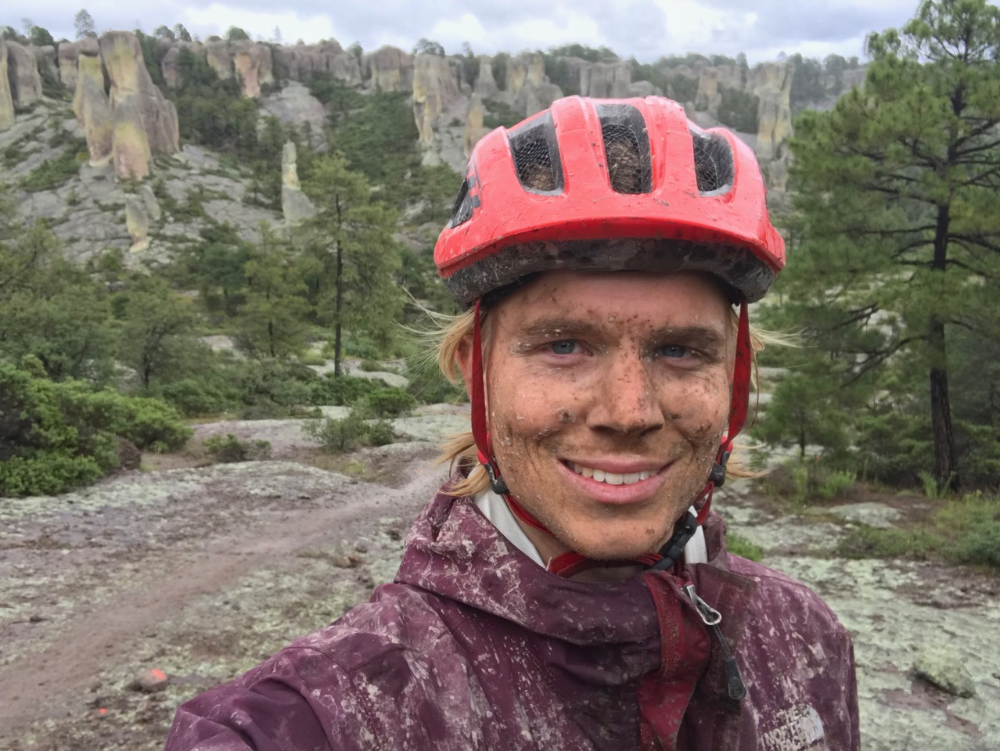
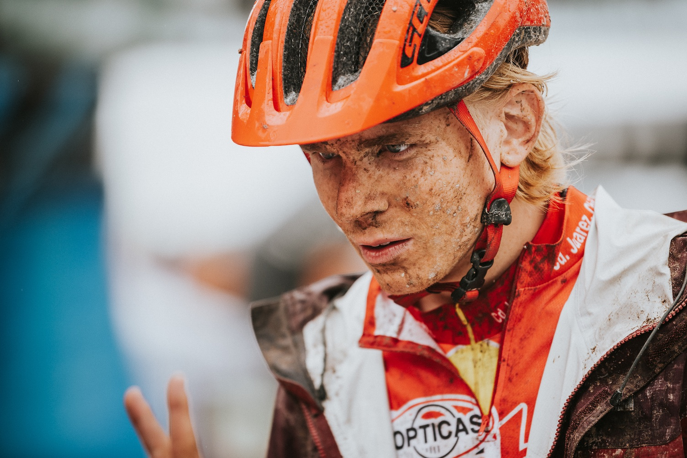
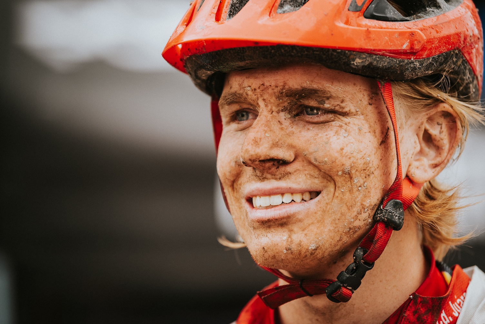
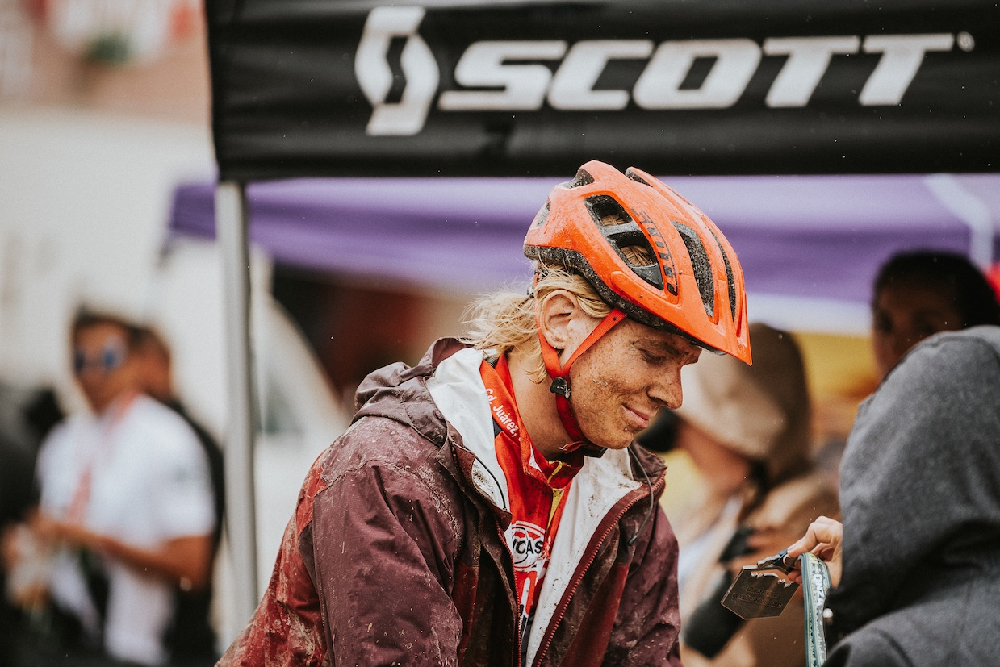
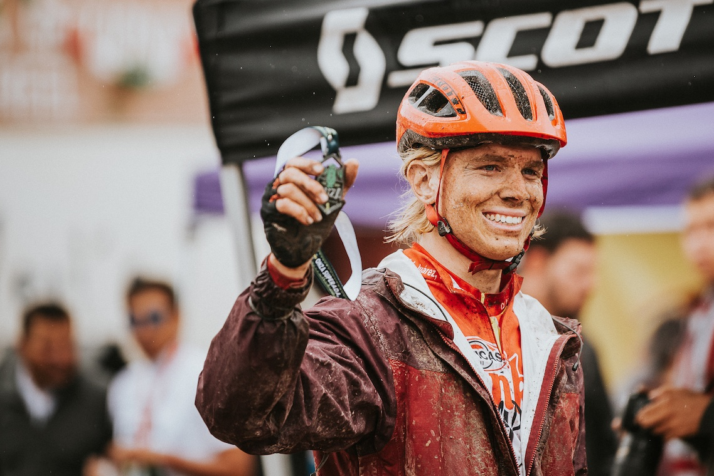

## Die härteste Erfahrung meines Lebens

Die Berichterstattung meiner vierten Woche fällt etwas anders aus als bisher. Heuer soll sich das Geschehen um die Ereignisse eines einzigen Tages drehen. Genauer gesagt, um die sechseinhalb Stunden im Wechsel von Freud und Leid, die ich an meinem vierten Wochenende bei einem weiteren Fahrradrennen geniessen durfte. 

Renntag in _Creel_: Die Vorzeichen stehen perfekt – für eine Schlammschlacht. Den Vortag und die ganze Nacht hindurch hat es geregnet. Bei leichtem Niesel versammeln wir uns also um 8 Uhr in der Früh beim Start. Um den Bedingungen irgendwie beizukommen, tragen _Ricardo_ und ich Plastiksäcke zwischen zwei Lagen Socken. Und nur dank eines Zufalles verfüge ich überhaupt über eine Regenjacke. Nach der Gluthitze beim Rennen vor zwei Wochen hätte ich nicht mit derart tiefen Temperaturen gerechnet. 

Unbeschwerte Stimmung am Start

Wissen sie schon, was ihnen bevorsteht?

Leicht fröstelnd begebe ich mich also auf die zwei Runden à 40 Kilometer. Auf den ersten Kilometern ist das Feld noch dicht. Einerseits erschwert mir dies, im eigenen Tempo zu fahren, andererseits bin ich jeweils froh um den Motivationsschub, wenn der Vordermann auf die Tube drückt. Die Strecke führt durch abwechslungsreiches Terrain, mal durch dichten Wald, dann wieder über offene Wiesen. Jedoch immer über matschigen Untergrund. Und so erstaunt es wenig, dass sich beim ersten steilen Aufstieg noch eine weitere Disziplin zum Radfahren gesellt: das Wandern. Um ein Haar – bzw. ein paar Zentimeter Wasserstand – würde es sich hierbei um einen Triathlon handeln. Auf einer Hochebene steht das Wasser nämlich so tief, dass einige Konkurrenten zum unfreiwilligen Bad darin verschwinden.

Schon nach wenigen Kilometern vom Schlamm überzogen

(Weitere eindrückliche Aufnahmen dieses Fotografen finden sich <a href=" https://www.facebook.com/ninebluepixels/?hc_ref=ARSqrzPZgCt3wW1mLuZuxAeahWXNcJhXXSWS0XvkQtKjjVhN5bwiM8wfBDe8m8khdD8&__xts__[0]=68.ARAgWd_39zZSs4pXhms46WsLoaEped0DHB6AqxlD9spNr0NuQNxyBxME40PKYMMcW8QnNxeTAqHc85X-24Mw-A6xPYHUBh2x8IvaYeYfsf8snfm-V10pMrdS_Xb-Cd3NjYSehK67vZMBmKWQimffCk-VL_0SbAbpKTlRFuF-zKTFcFsH2EXo&__tn__=kC-R">hier</a>.) #TODO: link to ninebluepixels

Dass ich dies überhaupt mitbekomme, grenzt an ein Wunder. Denn der Schlamm spritzt derart, dass die Sonnenbrille bereits nach fünf Minuten unbrauchbar ist. Und kaum ist dieser Schutz von den Augen genommen, werden meine Netzhäute von fiesen Mikropartikeln bombardiert. Eines davon fühlt sich derart wohl in meinem Sehorgan, dass ich mein kostbares Trinkwasser für eine Augendusche verschwenden muss. Wenigstens täuscht der stechende Schmerz im Auge über die gleichzeitige körperliche Anstrengung hinweg, sodass ich ordentlich Gas geben kann.

Diese treuen Begleiter haben ihr verdientes Lebensende erreicht

In dieser Phase habe ich nämlich bereits meine Tempogruppe gefunden und kann relativ gut mithalten. Dies ändert sich allerdings nach etwa 20 Kilometern – einem Viertel der Strecke. An diesem Punkt merke ich, dass die Vorderbremse den Geist aufgegeben hat. Und dies auch nur, weil ich mit dem Lenker aus mangelnder Bremskraft einen Baum streife. Sofort schiessen mir alle möglichen Horrorszenarien durch den Kopf und ich schwöre mir, dass Rennen zu beenden, sollte sich bei der Rennhälfte im Zielbereich kein Techniker finden. Vorerst jedoch soll die eine Bremse am Hinterrad genügen. 

Idyllische Umgebung, die über die Strapazen des Rennens hinwegtäuscht

Leider fordert der viele Dreck und Schlamm bald schon sein nächstes Opfer: den Wechsler. Mit zunehmender Renndauer fällt es mir nämlich immer schwerer, die Gänge zu schalten. Bald schon stehen mir nur noch deren vier zur Verfügung, was natürlich extrem in die Beine geht, wenn ich wieder eine Steigung mit viel Druck bewältigen muss. Da die Strecke nun aber mehrheitlich bergab führt, stellt dies noch kein allzu grosses Problem dar. Vor allem nicht im Schlusshang, wo sich die Einheimischen an der steilsten Stelle versammelt haben, um die Fahrer anzufeuern <a href="https://www.facebook.com/groups/1765511880421982/permalink/1908715236101645/?__xts__[0]=68.ARDOfenVIiD8T-oPETdnS3oGogY-bchIf2u6KhJgHze2qR0xc0fQvh2PjVcIuBPBfwfaYyKHVugluZIwlqsZ_rF5xIoGWrVvVfQOcugGlO_yOFHLK7TT6KpPhFfVB9YII1Xl6ZJt54VgJGR0A8vbAvVbgEoIU-CyizPUPd1JqLook7V3HPn0nQ&__tn__=-UC-R">und sich gelegentlich an einem Sturz zu ergötzen</a>.

Trotz unglücklichem Rennverlauf ganz zufrieden

Im Zielbereich kann man mir nicht gross weiterhelfen, da das benötigte Bremsöl gerade nicht vorrätig ist. Getrieben vom Leichtsinn denke ich mir: “Halb so wild, gehst’s auf der zweiten Runde einfach etwas ruhiger an”, und steige wieder auf den Sattel. Bereits im ersten Hang hinterfrage ich diese Entscheidung grundsätzlich. Die Beine schmerzen vom niedertourigen Pedalen, die Hände klamm von der Kälte, der Zuckerspiegel niedrig. Letzteres kann zumindest dank eines Zuckergelees mit Limonengeschmack behoben werden.

Komplett am Ende nach der Zieleinfahrt

Die neuerliche Euphorie hält jedoch nicht lange an. Nach weiteren kräftezehrenden Aufstiegen habe ich die Nase voll und möchte mir den Wechsler mal genauer anschauen. Dazu drehe ich den Drahtesel auf seinen Rücken und versuche, die elementaren Teile aus ihrem verklebten Zustand zu befreien – ein grosser Fehler. Wie sich bei der Weiterfahrt nämlich herausstellen sollte, hat nun auch die Hinterbremse ihren Dienst quittiert. Kenner der Veloszene würden nun von einem single-speed Fahrrad ohne Bremsen sprechen. Zu meinem Unglück werden diese bevorzugt in flachen Metropolen eingesetzt und garantiert nicht für Mountainbike-Rennen. Um diesen Schock zu verdauen, brauche ich erstmal einen Espresso – natürlich ebenfalls in Gelee-Form. Auch wenn dieser höchstens an das Kaffee-Level der Mokkaglace von der Migros herankommt, kann ich meine Gedanken wieder sammeln. Zurück ist keine Option, also geht’s weiter vorwärts durch den zähen Schlamm. Allzu steil hoch geht nun nicht mehr wegen der mangelnden Gänge; allzu steil hinab ebenfalls nicht wegen der fehlenden Bremsen. Zeit also, ein paar Fotos von der landschaftlich beeindruckenden Strecke zu machen. 

Kaputt aber glücklich

Zeit auch, für ein paar philosophische Gedanken. Kürzlich habe ich in einem Interview eine gute Antwort gelesen auf die Frage, wie man glücklicher sein kann: “_Erwartungen herunterschrauben: Sich darüber freuen, wenn etwas klappt, statt verpassten Gelegenheiten nachzutrauern_.” Dank dieser Umkehrung der Messlatte konnte ich bis anhin ganz gut mit den spärlichen Möglichkeiten in Juárez umgehen. Und sie zaubert mir auch in diesem tristen Moment ein Lächeln auf die Lippen. “Immerhin hab ich keinen Platten”. 
Als würde dieses epische Rennen von höheren Mächten beeinflusst, greift die Hinterbremse plötzlich wieder. Und genauso plötzlich wieder nicht. Dank diesem Umstand, weiteren Zuckergelees und den aufmunternden Worten der Streckenposten gelingt es mir irgendwie, diese zweite Runde durchzustossen, zu überleben.

Die Medallie macht dann auch keinen grossen Unterschied mehr...

... aber für eine Siegerpose reicht's dann allemal noch.

Während ich mich in der ersten Hälfte noch mit anderen Fahrern gemessen hatte, kämpfte ich in dieser zweiten Runde höchstens noch gegen meinen Kopf. Und entsprechend gross ist die Erlösung, als ich diesen Kampf nach sechs Stunden und fünfundzwanzig Minuten schliesslich gewinne und völlig kraftlos die Ziellinie überquere. Glücklicherweise warten dort bereits Freunde aus dem Biketeam von Juárez und versorgen mich sofort mit dem Nötigsten: einem energiereichen Imbiss und Bier. 
Unglaublich, was ich auf diesen 80 Kilometern alles erleben durfte. Womöglich war es die erschöpfendste Erfahrung meines bisherigen Lebens. Anstrengend genug zumindest, dass mir auch beim Schreiben dieser Zeilen noch die Finger schmerzen.
