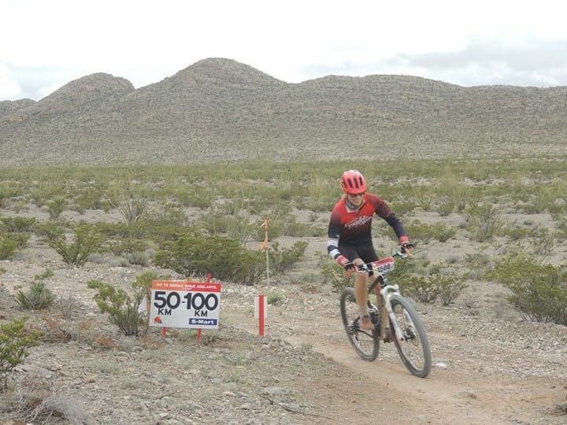

## 100 Kilometer durch die Wüste

Nach einem alkoholreichen Ausflug nach _Mazatlán_, zwei kräftezehrenden Fahrradrennen, zehn Wochen Praktikum und unzähligen genussvollen Mahlzeiten neigt sich meine Zeit in _Juárez_ langsam ihrem Ende zu. Und dieses Ende sollte den vorangegangenen Wochen in nichts nachstehen. Doch alles der Reihe nach.

Wenn die bereits bestrittenen Velorennen über 60 und 80 Kilometer einem Zweck gedient hatten, so war dieser lediglich, mich auf die ultimative Distanz über 100 Kilometer vorzubereiten. Eine solche fordert nämlich das legendäre Rennen _Chupacabras_, das alljährlich in der Wüste von _Juárez_ stattfindet. Bereits der Name lehnt sich an die lateinamerikanische Version von _Bigfoot_ an und versinnbildlicht wohl das Monster, das man auf dem Weg zum Ziel zu überwinden hat. Jedenfalls brachte bereits die Vorbereitungsphase genügend Potential mit sich für ein weiteres schauerhaftes Kapitel in meinem Reisebericht. Zuerst brach mir bei einer Trainingsausfahrt der hintere Dämpfer des Fahrrads auseinander, weshalb ich bis wenige Tage vor dem Rennen um meinen kampferprobten Drahtesel bangte. Danach befiel mich am Vortag des Rennens eine Halsstarre inklusive Erkältung. Und zu guter Letzt setzte selbigen Tags dermassen biblischer Regen ein, dass ich mich bereits vor einer Wiederholung der Ereignisse in _Creel_ fürchtete, wo mich auf der schlammigen Piste beinahe der Erschöpfungstod ereilt hatte.

Gute Laune vor dem Start am frühen Morgen

Am Renntag folgte schliesslich die Entwarnung: Meine Sorge um die Bodenbeschaffenheit sollte sich als überflüssig erweisen, denn der trockene Wüstenboden hatte den vorangegangen Starkregen erstaunlich gut verdaut. Trotzdem fühlte ich mich am Start nicht gerade blendend. Immerhin sorgten meine “Teamkollegen” für etwas Auflockerung: Wie etwa 20 andere Teilnehmer, durfte auch ich in der Kluft des lokalen Sportbrillenhändlers _Franklin Opticas_ antreten. Dieser sponsert in _Juárez_ die Veloequipe von _Ricardo_, der eine grosse Gefolgschaft von Hobbyradlern angehört. 

Der Startschuss erlöste mich sofort von meinen körperlichen Qualen. Ganz plötzlich fühlte ich mich wieder leicht und beweglich. Was ein wenig Testosteron nicht alles bewirken kann! Nach einer kurzen Tempophase fuhr ich meiner Startgruppe bereits vorne weg (weil dies meine erste Teilnahme war, musste ich in der Gruppe der Vorjahresränge 300-500 starten). Es sollte sich als wegweisend erweisen, dass ich mich nun an das Hinterrad eines kräftigen Mitstreiters hängte. Nennen wir ihn von nun an meinen Partner. Als mein Partner nämlich meine Präsenz bemerkte, half er mir bald schon mit Handzeichen zur Kennzeichnung potentieller Gefahrenstellen und forderte mich auf, in seinem Windschatten zu fahren. In dieser Konstellation überholten wir bald schon Wettstreiter aus der drei Minuten früher gestarteten Gruppe und machten ordentlich Ränge gut.

Bald schon wurde uns von den Streckenposten eine Position unter den besten 150 beschieden, was mich sehr überraschte: Bei der Startnummernverteilung am Vortag hatte sich die Verantwortliche nämlich noch über meinen Wunsch, unter den ersten 200 zu starten, belustigt und gemeint, hier bei _Chupacabras_ spielen andere Regeln als bei meinen bisherigen Rennen. Immerhin hatte ich sie mit der aktuellen Position bereits eines besseren belehrt und mein eigenes Ziel erfüllt. Doch mein Hunger nach einer besseren Klassierung war damit noch nicht gestillt.

In ähnlicher Art und Weise komplettierten wir also die erste Runde à 50 Kilometern, wobei mein Partner sich als sehr zuverlässige Zugmaschine erwies. Bis auf eine Kollision mit einem Stein, die einen Viertel meines linken Pedals (und beinahe des Fusses darauf) kostete, verlief alles glimpflich, und ich war vollen Mutes für den zweiten Durchgang dieses Kampfes.

Dieser Kampf begann erstmal damit, dass sich mein Partner mit scheinbar magischen Kräften immer weiter von mir entfernte. Nun brauchte ich mich irgendwie weiterhin zu motivieren. Dabei kam mir mein _Franklin_ Dress extrem gelegen. Das Team bestand nämlich nicht nur aus vielen Fahrern, sondern auch deren Familien. Und diese halfen – in Posten auf der gesamten Rennstrecke verteilt – den Teilnehmern mit kleinen Leckerbissen und Flüssigkeit weiter.
Wer nun aber zusätzlich noch in den Teamfarben anzurollen kam, wurde mit einem aufmunternden Applaus empfangen.

Nur ein Teil der _Franklin_-Familie

Nach etlichen Bananenstücklein und manchen Litern blauen Zuckersafts erblickte ich plötzlich wieder den vermissten Partner am Horizont. Dieser musste sich in einer plötzlichen Schwächephase befinden, anders liess sich sein Formtief nicht erklären. Doch kurze Zeit später erwischte es dann auch mich: Die abertausend Wiederholungen der immergleichen Beinbewegung forderten ihren Tribut in Form von Krämpfen. Und zwar in beide Richtungen: ob ich das Bein nun ausstreckte oder zusammenzog.

Mit dieser Limitierung hiess es nun also die letzten 25 Kilometer zu überleben. Eine Massnahme bestand darin, starke Anstiege gar nicht erst auf dem Rad zu versuchen, sondern sofort abzusteigen. Wobei auch dies starke Schmerzen verursachte. Als Trost blieb mir die motivierende Gewissheit, dass ich mich mittlerweile in die Top 100 vorgekämpft hatte. Doch diesen Rang galt es ebenfalls bis ins Ziel zu verteidigen.

Je näher ich also diesem Ziel kam, desto mehr Kraft verspürte ich wiederum in meinen Beinen. Dies ging so weit, dass ich auf den letzten zwei Kilometern sogar noch einen Sprint hinzulegen vermochte. Gemäss der Endanalyse auf meiner App handelte es sich dabei um die höchste Geschwindigkeit während des gesamten Rennens! Trotzdem musste ich nochmals kurz um meine Klassierung in den ersten Hundert bangen, als nämlich keine 500 Meter vor dem Ziel die Kette vom Blatt sprang. Eine kurze Panik später war ich jedoch wieder auf dem Sattel und versuchte, die verlorenen Ränge wieder wettzumachen. Bis auf einen Wettstreiter gelang mir dies und ich passierte als stolzer 65. die Ziellinie. 

Kaum vom Rad gestiegen drohten meine zitternden Beine unter dem eigenen Körpergewicht zu kollabieren. Glücklicherweise hatte die Rennorganisation diese Beschwerden bereits antizipiert und wartete entsprechend mit professionellen Massagen auf. Für die verkrampften Waden und Oberschenkel gab es eine angenehme Eiskühlung und ordentlich Druck. Dank dieser Behandlung würde ich am nächsten Tag nicht einmal den kleinsten Schmerz in den Beinen verspüren.

Eine Massage nach dem Rennen – ein himmlisches Gefühl 

Wieder auf den Beinen profitierte ich abermals von der familiären Unterstützung des _Franklin_ Teams in Form von _Burritos_ und Bier. Schliesslich schloss ich noch Freundschaft mit einem Koch, der gerade dabei war, leckere _Carnitas_ zuzubereiten. Natürlich war er besonders stolz darauf, seinem Schweizer Gast das edelste Stück Fleisch anzubieten, was dieser ohne zu Zögern annahm. Es schmeckte grossartig.