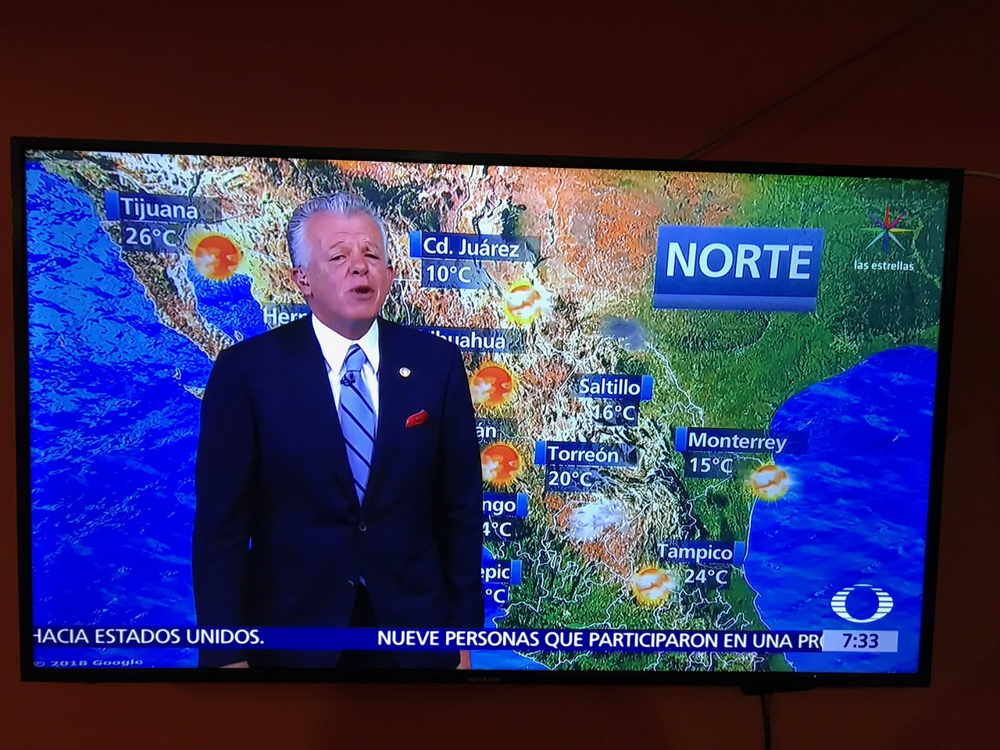
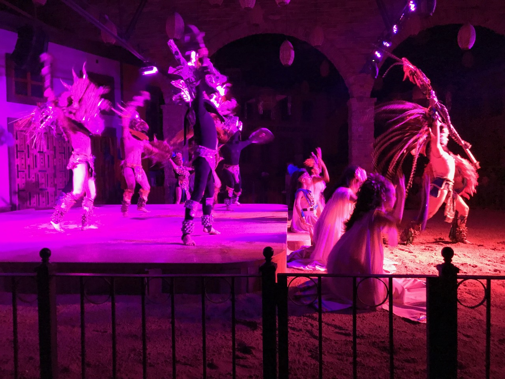
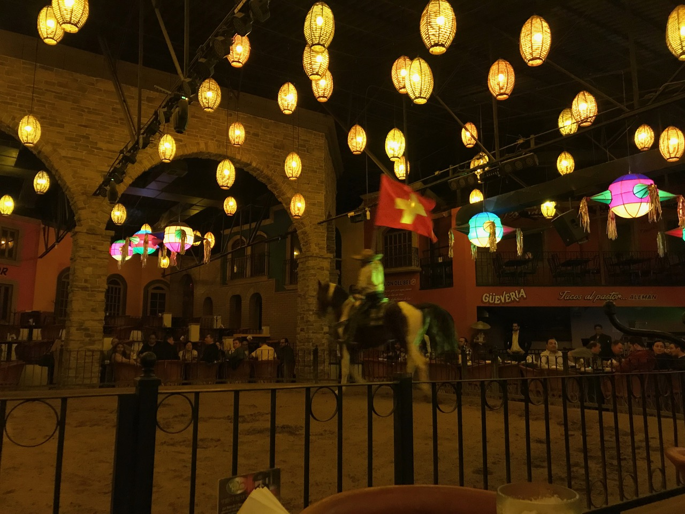
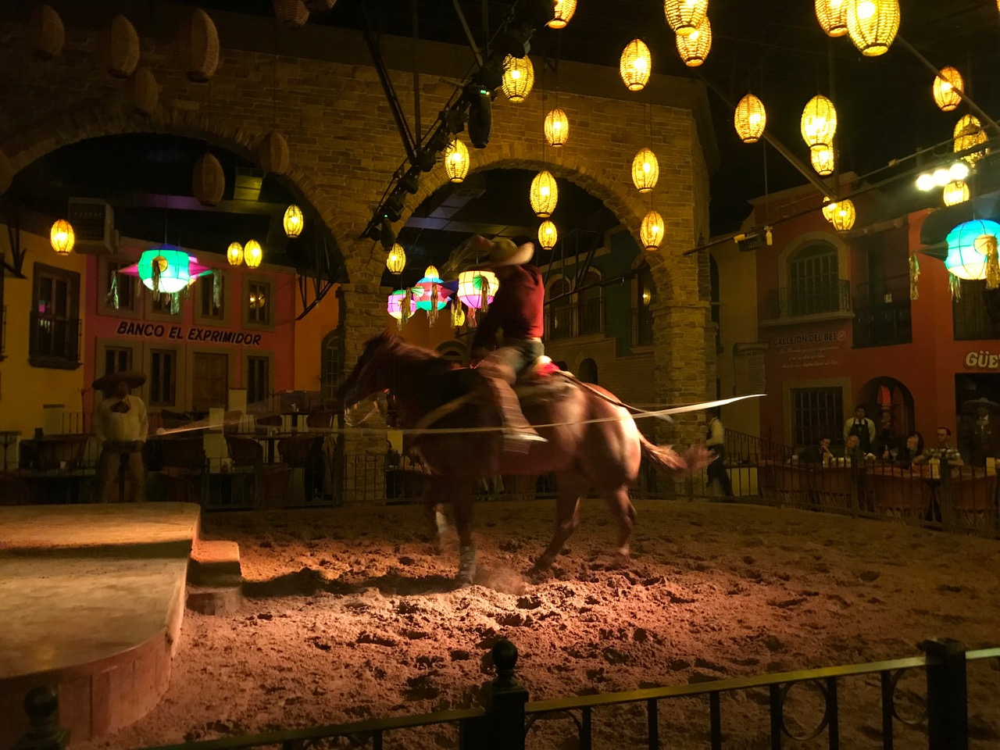
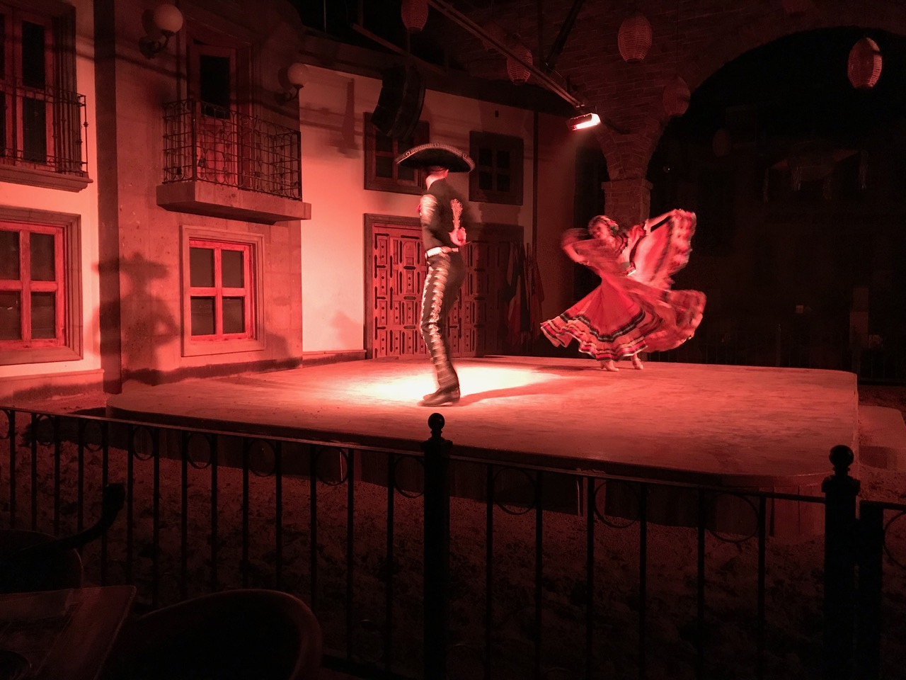
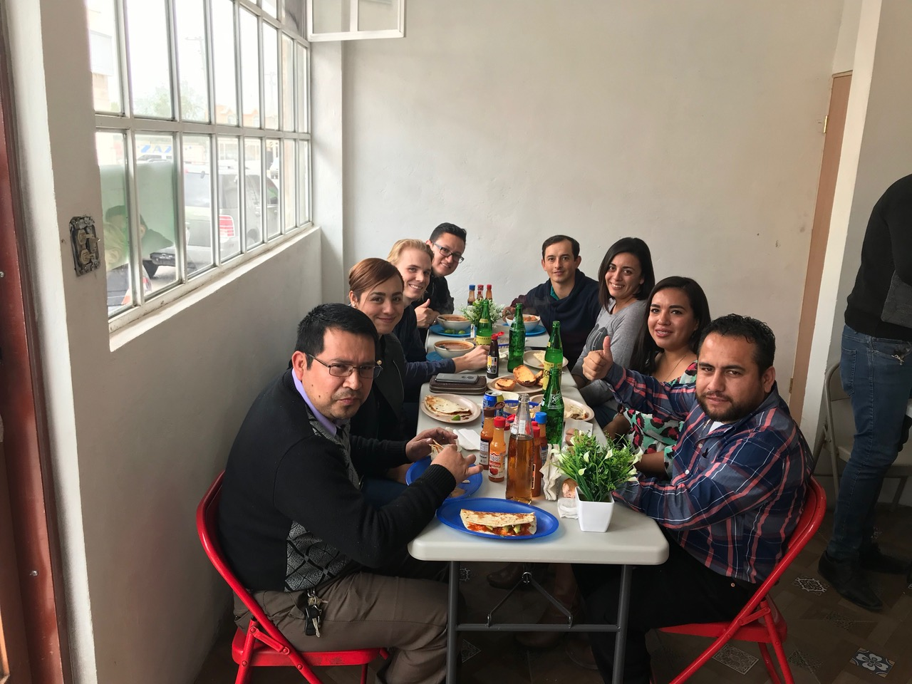
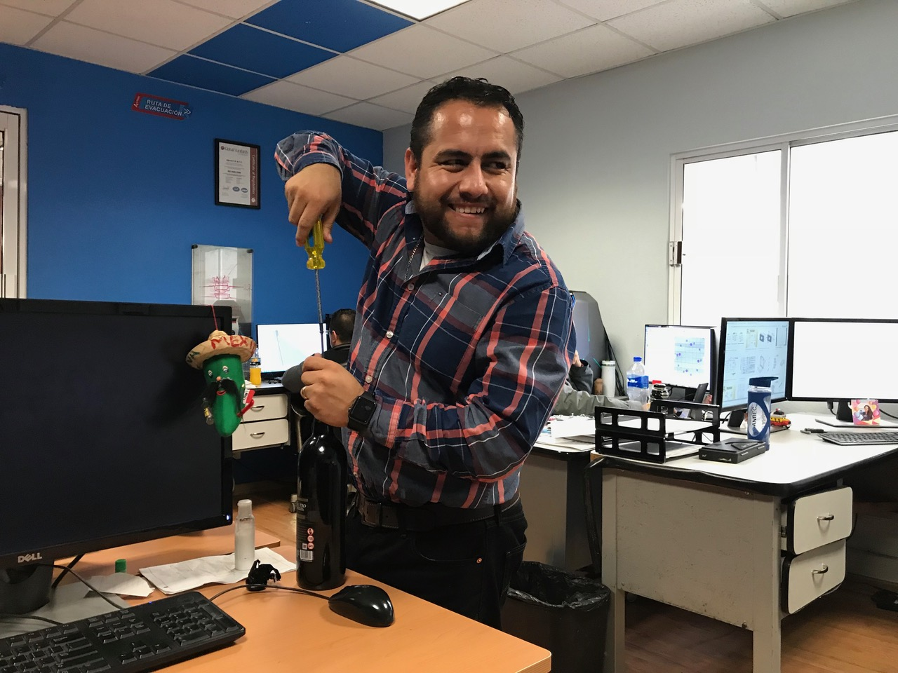
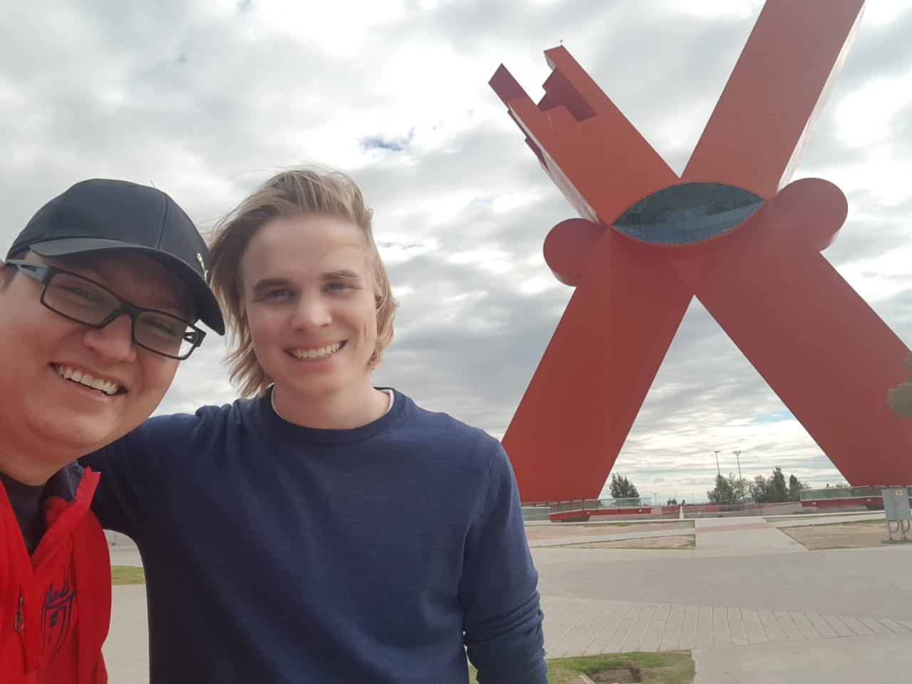

## Meine letzte Woche in _Juárez_

Zwar hatte ich bereits letzte Woche das Ende meiner Zeit in _Juárez_ heraufbeschworen gehabt. Doch leider bin ich bei der ausführlichen Beschreibung meines letzten Fahrradrennes stecken geblieben. Auf dieses anstrengende Wochenende folgte nämlich meine letzte Woche in der Stadt, aus der ich nochmals alles herausholen wollte, bevor ich mich in Richtung des wärmeren Südens aufmachen würde. In der Zwischenzeit hatte die morgendliche Temperatur nämlich eine unangenehme Nähe zur Null-Grad-Grenze erreicht.

Ja, auch in _México_ wird's kalt im Winter – zumindest im Norden

Am Mittwochabend nahm mich ein geselliger Velokollege, _Rafa_, auf eine für die Stadt typische Runde mit. Den Anfang machten mir im Restaurant _Viva México_, das weniger für seine Speisen und mehr für seine unterhaltsame Liveshow bekannt ist. Bei dieser nimmt einen die Truppe von Tänzern, Sängern und Reiter mit auf eine Schnellbleiche in mexikanischer Kultur. Konkret waren dies traditionelle Tänze in Trachten aus verschiedenen Staaten, Songs des legendären _Juan Gabriels_ und die Lasso-Künste von sogenannten _Vaqueros_ (_la vaca_ – die Kuh).

Einführung durch die mexikanischen Urahnen

Dieser Besuch hatte nebenbei den Vorteil, dass ich erstmals seit meiner Ankunft in _Juárez_ wieder auf andere Leute mit blondem Haar (_güeros_ – sprich: _ueros_) gestossen bin.

Begrüssung der internationalen Gäste

Den Abend setzten wir danach fort in einer Bar mit dem – für Europäer gewöhnungsbedürftigen – Konzept, dass man von einer persönlichen Bediensteten mit Getränken versorgt und mit Gesprächen unterhalten wird. Interessanterweise hielten sich in der Bar aber nicht nur einsame Männer auf, sondern auch Frauen, die sich lebhaft mit den Kellnerinnen unterhielten. Unsere Partnerin sprach fliessend Englisch, weil sie während zweier Jahre in _Las Vegas_ gelebt hatte. Diese Erfahrung führte ebenfalls zu interessanten Vergleichen der beiden womöglich hässlichsten Städte der Welt.

Lasso-Künste

Als Abschluss und einzig mögliche Steigerungsform des bisherigen Abends wollte mir _Rafa_ schliesslich noch den bekanntesten Stripclub der Stadt zeigen. Auch wenn meine Erfahrung bei _Amadeus_ eine Schlechte war, bin ich froh um sie: Mit grosser Sicherheit werde ich für den Rest meines Lebens keinen Fuss mehr in ein solches Establishment setzen. Zumindest nicht zu meiner eigenen Unterhalten – _Rafa_ behauptete nämlich, für seine geschäftlichen Kundenbeziehungen seien solche Besuche durchaus förderlich und werden sogar von der Firma bezahlt. Bin ja mal gespannt, wohin mich meine Karriere führen wird.

Volkstänze

Doch fürs Erste folgte der letzte Tag meiner Karriere bei _Alprema_. Zum Mittagessen folgte mir die Mehrheit des Ingenieurbüros zu meiner Lieblingsspeise _Caldo de Pescado_. Zurück am Arbeitsplatz entkorkte der Chef danach höchstpersönlich eine schlechte Flasche Rotwein – ganz der Ingenieur – mithilfe einer Schraube. Es folgte eine wacklige Rede meinerseits auf Spanisch, in der ich nach mexikanischer Art mein Haus zum Haus meiner Freunde erklärte (verzeiht mir bitte, Mama und Papa). Zu guter Letzt wollten mir alle noch – wiederum ganz traditionell – mit schwarzem Filzstift eine Abschiedsbotschaft auf das Leibchen schreiben. Dieses war mir jedoch zu schade, weshalb mir _David_ kurzerhand ein fleckiges Shirt von _Calvin Klein_ schenkte (natürlich nicht ohne zu betonen, wie teuer dieses gewesen sei). Das hätte er sich sparen können: die Botschaften fielen enttäuschend nüchtern aus…

Genuss von _Caldo de Pescado_ und _Quesadilla de Camarón_

_David_ – der Ingenieur aus dem Lehrbuch

Am Samstagmorgen wollte mir mein bester mexikanischer Freund _Eder_ schliesslich in grösster Eile noch möglichst viel _Juárez_ zuführen. Dazu frühstückten wir zuerst in seinem liebsten _Menudo_-Lokal (man erinnere sich: diese Speise gilt als bestes Anti-Kater-Mittel), bevor er mich zu _Juárez’_ Wahrzeichen, dem _Equis_ (spanisch für X, kann aber auch im Sinne von _irgendwas_ verwendet werden) chauffierte. Dieses Andenken an den grossen _Benito Juárez_ macht seinem Namen meiner Meinung nach alle Ehre und präsentiert einfach nur _irgendwas_. Trotz meines mangelnden Verständnisses für die Bedeutung dieses Wahrzeichens hatten wir einigen Spass dort. Zum Abschluss schenkte mir _Eder_ sogar noch sein emotionsgeladenes Trikot der Nationalmannschaft, das Tragen dessen mich quasi zum mexikanischen Landsmann werden lässt. 

Bei der nächsten Zusammenkunft hoffentlich mit dem _Grossmünster_ im Hintergrund

Mit diesen wunderschönen Eindrücken verabschiedeten wir uns schliesslich im Busterminal, wo ich ihn ein letztes Mal zur Einhaltung seines Versprechens aufforderte, im kommenden Jahr in die _Schweiz_ zu reisen. Danach betrat ich meine Verbindung in Richtung _Chihuahua_, womit endlich der zweite Teil meines Aufenthalts in Mexiko beginnen sollte.