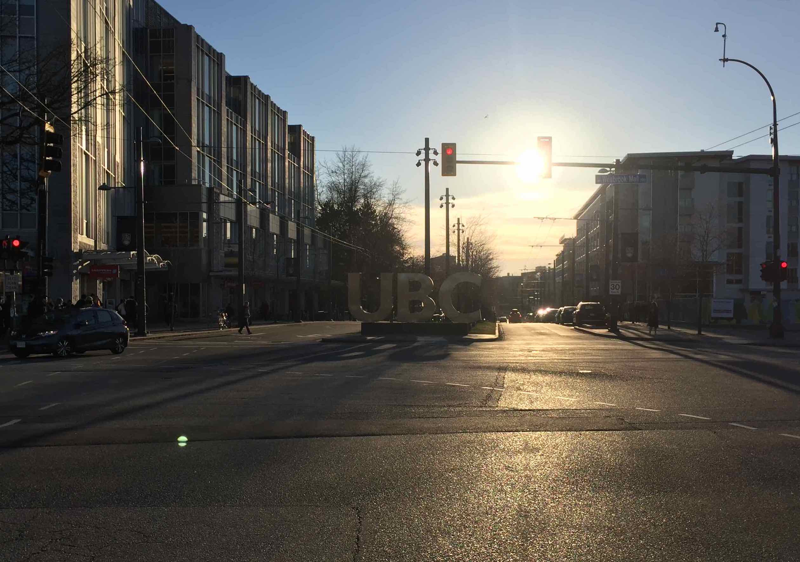

In my [last report](./van1.md) you could read about the exciting start of my exchange semester. I wrote about parties, snowball fights, skiing, and parties. I later had to realize that this single-sided narrative made some people worry about the state of my studies. And especially about the state of my hairstyle.
Therefore, I will dedicate this _entire_ episode to counteract those disbeliefs and prove that indeed both – my studies and hair – are doing quite well. So, let me begin with

## My Courses at UBC

The lecture that gives me the most pleasure is a _Computer Science_ course on _Data Structures and Algorithms_. It helped me to finally overcome my fear of _Recursion_ and also made me understand why a _Sorted List_ is such a big thing among nerds. Never before have I ever had such passionate instructors. And their joy has certainly also infected me. I get to write code on a regular basis and often with a spectacular outcome like the one below.

 
Not quite as good as the original, but _Lichtenstein_ also didn't have to code.

Next up, I decided to invest in my cultural education and thus visit lectures in _Wine Science_. Two times a week I get to know stuff about wine growing regions, _varietal characters_, and how to best prune your vines. While such knowledge does not always strike me as overly relevant for future dinner-table small-talk, the weekly wine tasting certainly does. There, we get to taste between two and three different kinds of wine from all around the world. But we don't do so to our enjoyment only, **NO**! The objective is to assess this luxurious good in terms of color, acidity, sweetness, astringency, and so on. While this already seems like quite a daunting challenge, imagine yourself weighing the wine's body with your tongue and expressing it in terms of a scale between skim milk and whole milk. Yes, this last example will also be part of the final exam.
You might wonder, what kind of professor teaches such bizarre stuff? I am happy to respond, that our prof is just about the perfectly strange guy for the job. Students giving the right answers get fist bumped and he could easily talk about wine aromas for hours on end. 

Someone has no idea what he's doing. _Educated guessing_ all the way!

From an early age on, I have shown large interest in reading newspapers and learning about what's happening all around the planet. For my miscellaneous studies in _Vancouver_, I have decided to lift this hobby to the next level by taking a course in _Global Politics_. To my slight disappointment, we are talking much more about historic events rather than current ones. Still, the course has taught me a useful framework to process the information we are constantly bombarded with these days. Recently, I had the pleasure to write a paper of eight pages and decided to do so on _Environmental Politics_, an old hobby horse of mine.

For lack of a better depiction, just have a look at the beautifully crafted lecture slides.

Last, but also least, I would like to introduce you to my course in _Human Computer Interaction_. Despite its fancy name, this lecture fails to captivate my interest. As a first nuisance, the course is scheduled on Thursday nights, always colliding with my social life. Secondly, the professor doesn't provide much more insight than his lecture slides, making attendance basically optional (which makes skipping it less bad). And thirdly, the lecture impresses with its disproportionately huge workload. Luckily, that one is shared between me and my fellow group members, who show surprisingly much understanding of my _extracurricular obligations_ as an exchange student. Other than that, I will surely take away some good practices of interaction design and how to avoid common pitfalls.

My heroic team members: _Doojin_, _Shavon_, and _Matt_

This eclectic selection of courses might make you wonder, how exactly they relate to my mechanical-engineering curriculum. They don't really, but I am still glad to have taken them. Back in the days, choosing the subject of my studies gave me quite a hard time. During high school, I had equally enjoyed my lectures on _Latin_, _Math_, and _History_. The choice of _Mechanical Engineering_ – while being a broad topic – was still a choice of the mathematical direction. Many times, I later wondered whether I would have also made a good language or even art student. And now, I finally feel like having received an answer to this question. As much as I enjoy the excursion into _Political_ and _Wine Science_, such studies would not have satisfied me in the long run. I crave for logical puzzles and can't stand learning principles by heart without fully understanding their origins. This helped me realize that _Engineering_ was the right choice!

Thanks, UBC, you've helped me come to terms with my choices.

This in-depth analysis of my courses has certainly tired you, my dear reader, to the same extent my studies have tired me during the first half of the term. So, how about we take a break together and fly out for a quick trip to

## Hawaii

At least, that's what I did. During the so-called _reading week_, I joined my fellow exchange friends for an awesome adventure in _Honolulu_.

My Swiss-Austrian fellowship: _Nick_, _Eray_, and _Teresa_

Our plan was relatively simple:

### 1. Hike

### 2. Chill

### 3. Surf

### 4. Eat

### 5. And Be Silly

According to these metrics, our little holiday was a major success. Situated right in the heart of _Waikiki_, it took us no more than 5 minutes to get to the beach. This together with the 24/7-availability of surfboards at our Airbnb left us with no real alternative to surfing (I've never been more willing to accept a restriction). Once, we have finally made it outside of Downtown, we usually sought discomfort in the form of hiking. 

Seeking tranquility in nature...

... was not always successful.

Back in town, we then comforted our growling stomachs with some heavy and delicious Hawaiian food.

I mean just look at that _Poké_!

All the while, there were many opportunities to quit the serious-student-mode and just have a little fun.

Not sure how to describe what's going on in this picture.

Oh, and the best picture I've taken on all of beautiful _O'ahu_? Probably this one inside the world's biggest assortment of Hawaiian shirts.

Even so-called celebrities like _Nicolas Cage_ have been to this place!

Well, so much about the good stuff. Now back to the bitter reality of Canadian winters! Do you know this feeling when the very best time of your life suddenly turns into some of the worst? That's about how I felt exchanging the mild Hawaiian climate and plenty of sunny hours with the short and wet days back on UBC campus. And if that alone had not sufficed in depressing me, then the burglar who came to steal my phone and laptop surely did.

The aftermath of the burglary.

Without going too much into the details, someone must have watched me working on the computer from outside and then took advantage of the little time I spent getting ready for bed in the washroom by ripping open the (already open) window and squeezing in through the opening. Sparing all other devices, the intruder certainly made a case for the high quality of _Apple_ products. And after all, at least they left me my tennis racket.

Recovering from such a shock doesn't come easy and to this day I'm haunted by this weird flashback from the moment of coming back into the room, realizing the incomprehensible thing that just happened. Luckily, I was surrounded by people that took good care of me. One friend lent his spare phone, another provided me with a laptop. Then again, others helped me endure the anxiety with activities.

Skiing on _Grouse Mountain_ with _Daniele_, another Swiss from my home uni.

The story finally came to a happy end, when I heard about a fellow Swiss student's parents coming over for a visit. My parents then brought his parents some old devices of mine (and loads of chocolate). Within a week of the incident, I got back on tracks and was independent again. Should you read this, Raphaël, once again many thanks to you!

So, yeah, no more fancy GIFs for the moment, sorry. As an alternative, though, I can offer mouth-watering images of the results of cooking which I've taken up doing more seriously over here.

Yummi!

That's it for this month, thanks for reading! Expect to hear back from me one last time, once this whole adventure has come to an end. Until then take care and close your windows,  
Nicola

PS: In case you're still concerned about my hairstyle, here's the final proof that everything is alright:

