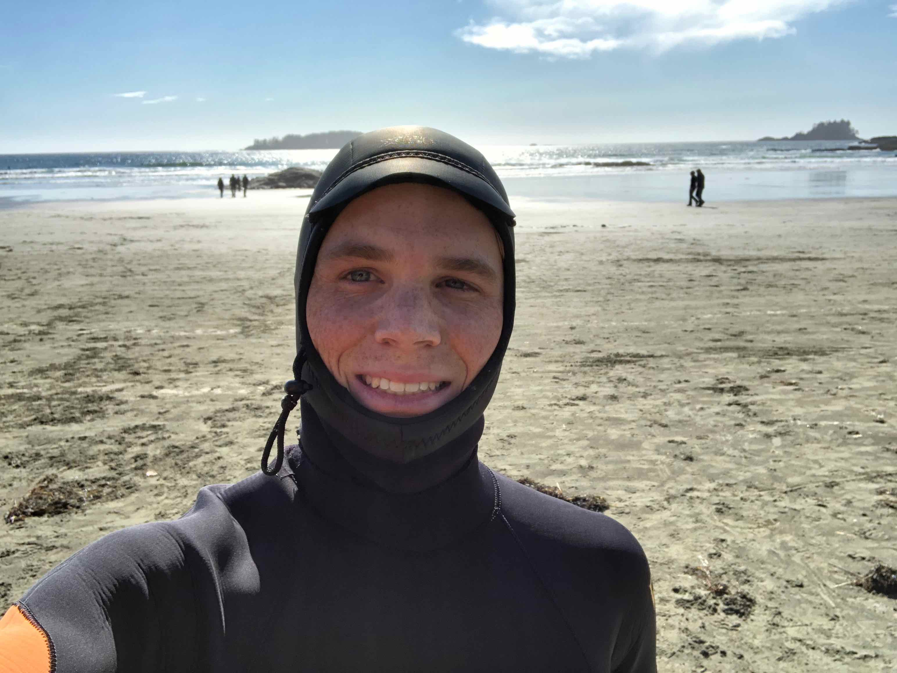

More than a month has passed since my [last report](./van2.md). In the meantime, temperatures in _Vancouver_ have been on the rise, putting an end to the _Winter Blues_. But my friend, _Gabriel_, and I couldn't just accept the melting fate of the snow and decided to head out for one last adventure in the big white. On a sunny afternoon, we loaded our skiing gear into a car and drove off to _Mt. Seymour_. Like the other two peaks close to the city, _Mt. Seymour_ is equipped with a ski-lift, which we used for a couple of rides. Once we felt ready, we put skins on the skis and started our ascent. 

_Gabriel_ leaving behind Downtown _Vancouver_.

The goal of our mission was to find a kicker, called _The City Booter_, somewhere out in the back-country. Jumping off that thing promised to result in stunning photos with the city in the background. Before long, we found our target that had apparently suffered under the influence of the sun. Some shaping and camera setup later we were ready for take-off. Four hours of hard work finally resulted in the following – definitely justifying the effort.

It felt like jumping right back onto campus.

The retreat of the snow also marked the begin of the long-awaited hiking season. Together with four other passionate hikers, I seized the opportunity on a cloud-free Saturday. We drove up north towards _Squamish_ and climbed up _The Chief Trail_. Its three peaks each offered beautiful views and made for a varied round-tour.

On top of the _Chief_: _Sofie_, _Raphaël_, me, _Marion_, and _Matilde_.

Instead of enjoying the view, though, we focused our attention on the board of _Backgammon_ I had brought along. Almost everyone knew how to play the game – a rarity compared to my previous travels. Having a fun time in the sun, we kicked off a little tournament where _Sofie_ emerged as the winner.

This afternoon had just about everything I could desire.

Infected with the board-game-fever, we continued playing back in town the next day. At a bar entirely dedicated to this kind of pastime, we opened a box of _Monopoly_ and immersed ourselves in an epic four-hour battle. Despite claiming it as my all-time favorite game, I realized I had never played it the _real_ way before. Because the _real_ way means playing until one single monopolist prevails. After several hours proved not to be sufficient to this end, we called it off and went home.

The smile of a monopolist: three players had already given up.

Whenever I seek diversion during daylight, I give _Nick_ a call. Apart from the name, _Nick_ and I also share a passion for tennis. This resulted in quick matches on almost a weekly basis. Despite my biggest efforts, I just can't beat him. Breaking his services normally results in me losing my nerves and subsequently the game. All those failures when playing on courts (and game-boards) slowly raise the question: "Do I lack a winner's mentality?".

Analysis turns hypnosis.

But the two of us don't just compete. Sometimes we help each other climb walls. This was necessary when we competed in UBC's _Storm the Wall_ challenge. The long-standing tradition foresees students to complete a triathlon course followed by climbing a big-ass wall with the help of others.

Practice run – good thing I got help to get up there.

While the challenge is mainly aimed at student teams that split up the work, we decided to do it each on our own. Both of us successfully made it through the course, marking my very first triathlon experience. And hopefully not the last one.

Happy and exhausted after the race.

Speaking of recreation, I've always wanted to hit the bike trails of _North Vancouver_. To spice things up a bit, I joined my fellow exchange friend _James_, who has already competed in professional races all around the world. This became pretty evident once the trails' steepness increased. While he took the obstacles in a breeze, I was sweating my ass off and struggled not to fall from the bike. However, the final knockout blow came when we went back downhill. Never before had I seen anyone ride so effortlessly – and stylish. Thanks for the lesson, _James_.

_Vancouver's_ forests make for a unique biking experience.

The novice and his master.

You might go: "Wow, so much activity, do you ever eat and sleep?" Well, sleep not so much, but I compensate that lack with a lot of food. As a most recent example, I teamed up with my Japanese friend _Erina_ to produce a delicious batch of _Gyoza_. In case you are just as much of a dumpling-lover as I am, let me assure you: it's way easier than you might think it is.

Even _Erina_ was amazed by the result.

In an attempt to revive old traditions (long-time readers may remember), I took to baking _Zopf_ again. Compared to Chocolate and cheese, this Swiss specialty doesn't require as much hardware and can be made with little know-how. The latter we got from _Tony's_ mom, another Swiss exchange student who was just as eager on the bread as I was. We had a fun time beating up the dough, even if the result wasn't as exciting as we had hoped.

_Tony_ kneading like a pro.

Giving it a nice egg-yolk-finish.

Not necessarily sleep, but at least relaxation was what I promised myself from the following camping trip to _Tofino_. Together with hordes of other exchange students, I forced myself out of bed at 5 AM on a Friday morning to catch a bus to the ferry terminal. On the ferry to _Vancouver Island_ people were slowly starting to wake up and resumed their typical exchangee-behavior.

_Brooke_ engaging in some early-morning gymnastics.

So far, the weather was looking very promising, but once we had crossed the island's mountain range, things started to change dramatically. Spirits reached an all-time low when we were forced to set up the tents in the pouring rain. Dripping wet, two friends and I left the campground to dry ourselves in a bar over beers and burgers.

_What a bummer!_ – arrival in _Tofino_ in the pouring rain.

From now on, things could only get better. On Saturday morning, some 25 of us gathered at the beach for a surf lesson. With the delay one would typically expect of surfers, our instructors eventually turned up with the gear. We got into our tight wet-suits, grabbed a surfboard, and off we went into the cold water. While the temperature was chilling at best, the wet-suit did a great job at keeping me warm. Warm enough, that I would have loved to keep going even after two hours of surfing. Until then, I had managed to ride a few waves and had a great time. Even if the swell wasn't quite as pristine as back in _Mexico_.

Sealed up and ready to go.

Waiting for their next use: our surfboards.

In the afternoon, our exhausted crowd boarded a shuttle to the town. There, we set off for an easy stroll - termed a hike – along the shores. Somehow we ended up on the marvelous terrace of a luxurious lodge where we lost ourselves in dreams of a future life as affluent people: playing chess and reading books all day long.

The place where I would like to "recover from a Burnout".

Soon enough, this wonderful day came to an end. Since it was our last night already, everyone mobilized their remaining energy for a relaxed "beach party" around the bonfire. Over [_S'mores_](https://en.wikipedia.org/wiki/S'more) and beers, we resisted the cold until the last log had burnt to ashes.

Mesmerizing colors as the sun sets over _Tofino_.

Coveted spots around the fire.

Back on campus, our term was nearing its end. On the very last day of classes, UBC had one last highlight ready for us. Overnight, workers had set up a stage on the main square where later that day the _Block Party_ was going to happen. The exchange community, however, decided that our party should start way earlier. Hence, some of us met as early as 9 AM to start fueling their motors. I had to stay (semi-) sober for a project presentation in the early afternoon before I could join the fun. For lack of a better measure, the police tolerated our outdoor party. At some point, people started moving over to the official fest, but not everyone made it there. After some queuing, we finally got in – sober again. To our shock, beers were sold out as early as 7 PM, which didn't help much in enduring _Tyga's_ concert. 

The _Block Party_, a concert right on campus.

My time as an exchange student was now slowly running out. When I had attended language school in the city four years ago, I was lucky to meet several amazing families that I had not seen ever since. The _Damascellis_ had hosted me back in the days and helped out whenever they could. Their son, _Matteo_, is around my age and studies at UBC, too. Unlike me, as a full-time student, though. I was very pleased when they invited me once more for a tasty Italian dinner at their place.

The _Damascellis_: _Andrea_, _Hunter_, _Matteo_, _Luca_, and _Barbara_.

Next, I was eager to catch up with my former host parents, _Pat_ and _Ken_. The _MacKenzies_ reside in a calm neighborhood in _North Van_, where I had lived for more than a month. Going there felt like stepping into a time machine. The two have hardly aged and similarly, their house has remained unchanged. Once again, I had a lovely evening full of good memories.

_Pat_ wandering around the treetops.

When staying with the _MacKenzies_, I had also gotten in touch with their neighbors, _Nina_ and _Roy_. In the meantime, they had moved to the calm town of _Comox_ on _Vancouver Island_. There, I was invited to stay with them for two days. Such a change of scenes came just at the right time during the exam phase. Relaxing at their place allowed me to slow down and clear my head. _Nina_ also proved to be full of wisdom when it came to matters of the heart.

_Nina_ on one of our many walks in tranquil _Comox_.

My sanatorium for two days – far away from all trouble.

With my batteries fully charged again, I took the bus to the other side of _Vancouver Island_. Once more I wanted to experience magical _Tofino_: this time by surfing only, though. For three straight days, I strapped my rental board onto a bike and rode to the closest beach. The weather showed itself in all possible forms, from calm and sunny days to wild storms that stirred up the sea. For my mornings and evenings in the hostel, I got to meet interesting folk from all around the world and suddenly found myself in conversations about _Degrowth_ and _David Foster Wallace_.

Happy doing what makes me happy these days.

My ride to get around town.

Soon after, I dropped the pen on my last exam at UBC. My term in Vancouver had officially come to its end. And with it a time full of amazing new experiences worth remembering and new friendships worth keeping up. At this point I would like to thank all the people that have crossed my paths during the past four months: 

### You guys were the magic ingredient of my awesome time!

Thanks for reading. You'll hear more from me at some point in the future.

Cheers,  
Nicola